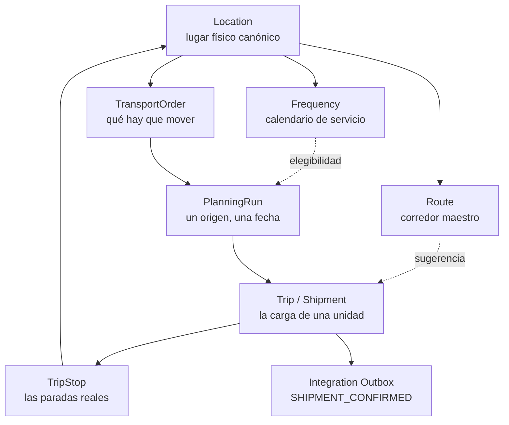

# TMS by EBIM — mapa del dominio V2

Una página para orientarse: qué entidades existen, cómo se encadenan y dónde está documentada
cada una. No es la fuente de verdad de ninguna regla — cada documento de dominio lo es de la suya.

Estado: migraciones `V1`–`V23` en el repositorio; `V23` es la última. La planificación automática V1 no necesitó esquema nuevo. Referencia conceptual: Oracle OTM,
adaptada, no copiada.

---

## 1. La cadena



```text
Locations → Frequencies → Routes → Orders → Planning → Shipment/Trip → Integración de ejecución
```

---

## 2. Los dos conceptos que más se confunden

**Tipo frente a uso operacional.** Un `Location` tiene un `LocationType` (qué es: tienda, CD,
planta, hub) y un conjunto de `LocationRole` (cómo puede usarse: `ORIGIN`, `DESTINATION`). Una
tienda que recibe la entrega y despacha la devolución es **un** registro con los dos usos.
Orígenes y Destinos son vistas filtradas de ese maestro, no maestros propios.

**Ruta maestra frente a ruta de viaje.** Una `Route` es una plantilla — el orden en que
normalmente se sirve un corredor. Las paradas de un viaje (`TripStop`) se derivan siempre de sus
asignaciones activas. Aplicar una ruta a un viaje es una sugerencia de secuencia, no un vínculo.

---

## 3. Módulos y propiedad

| Módulo | Posee | Puerta hacia afuera |
|---|---|---|
| `masterdata` | Location, Zone, Frequency, LocationFrequency, Route | `OriginLookupPort`, `DestinationLookupPort`, `RouteTemplateLookupPort`, `ServiceCalendarPort` |
| `fleet` | Carrier, VehicleType, Vehicle, capacidad efectiva | `VehicleLookupPort`, `CarrierLookupPort` |
| `orders` | TransportOrder, líneas, totales, ciclo de vida | `OrderPlanningPort`, `OrderIntakePort` |
| `planning` | PlanningRun, Trip, TripStop, asignaciones, capacidad, motor automático | `ShipmentPublicationPort` |
| `integration` | Clientes M2M, inbox, upserts, outbox | API `/api/integrations/v1` |
| `shared` | Puertos, seguridad, paginación, importación, auditoría | — |

Ningún módulo de negocio importa otro. Todo cruce pasa por un puerto en `shared.reference` que no
carga ningún tipo del módulo dueño, y `ModuleBoundaryTest` lo verifica en cada build.

---

## 4. Defensa multitenant, por capas

```text
JWT de Supabase
   → Membership resuelta en servidor
   → CompanyScope (nunca un companyId del cliente)
   → Service
   → Repository (predicado de compañía dentro de la consulta)
   → FK compuesta (referencia_id, company_id)
   → RLS de PostgreSQL sobre el rol tms_app
```

Ninguna capa se apoya sola. La FK compuesta hace imposible una referencia cruzada aunque un
servicio se equivoque; RLS hace invisible la fila aunque la consulta pierda su predicado.

---

## 5. Documentación por dominio

| Tema | Documento |
|---|---|
| Ubicaciones, tipos, usos operacionales | `docs/domain/LOCATIONS.md` |
| Frecuencias, cadencia y excepciones | `docs/domain/FREQUENCIES.md` |
| Rutas maestras | `docs/domain/ROUTES.md` |
| Transportistas, tipos de unidad, unidades | `docs/domain/FLEET.md` |
| Pedidos | `docs/domain/ORDERS.md` |
| Planning, Trip/Shipment, planificación automática | `docs/domain/PLANNING_SHIPMENT.md` |
| Capacidad y cubicaje | `docs/domain/CAPACITY_MODEL.md` |
| Importación masiva | `docs/domain/IMPORT_FLOW_V1.md` |
| Traza de auditoría | `docs/domain/AUDIT_TRAIL_V1.md` |
| API inbound M2M | `docs/integrations/INBOUND_API_V1.md` |
| Publicación de shipment | `docs/integrations/OUTBOUND_SHIPMENT_V1.md` |
| Google Maps | `docs/integrations/GOOGLE_MAPS.md` |
| Modelo de datos por migración | `docs/database/DATA_MODEL.md` |

ADRs: `ADR-001` capas, `ADR-002` Flyway, `ADR-003` tenancy por compañía, `ADR-004` exposición de
esquema, `ADR-005` RLS por rol de runtime, `ADR_LOCATION_MODEL` maestro canónico de ubicación.

---

## 6. Aplazado por decisión

No implementar sin un requisito concreto y un ADR: OR-Tools, Kafka, event sourcing, multimodal
(marítimo/aéreo/ferroviario), freight payment, tendering, tarifas complejas, Realtime, Storage,
tracking en vivo.

Lo que sí está preparado para no estorbar cuando lleguen: `PlanningEngine` admite un solver al
lado del heurístico; el outbox admite otro transporte sin tocar la transacción de negocio; los
puertos de `shared.reference` admiten otra implementación sin tocar a los consumidores.
