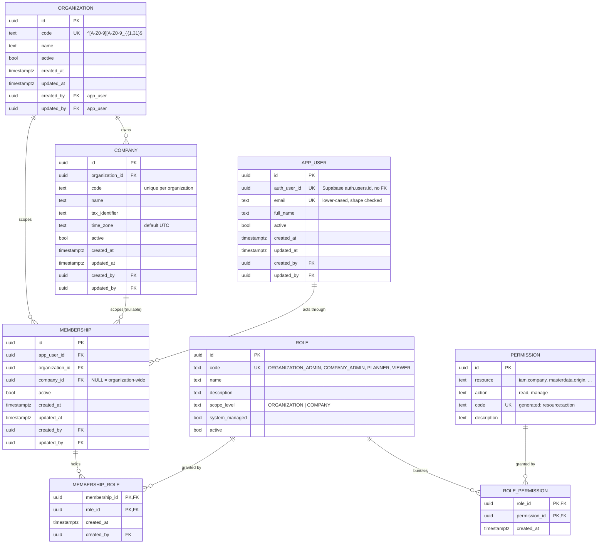
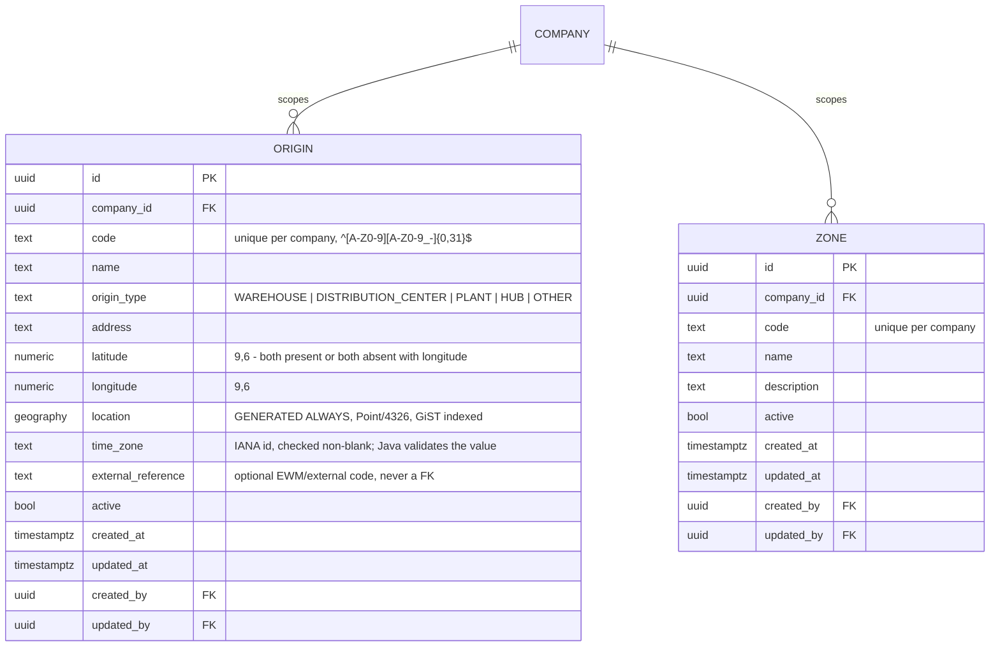
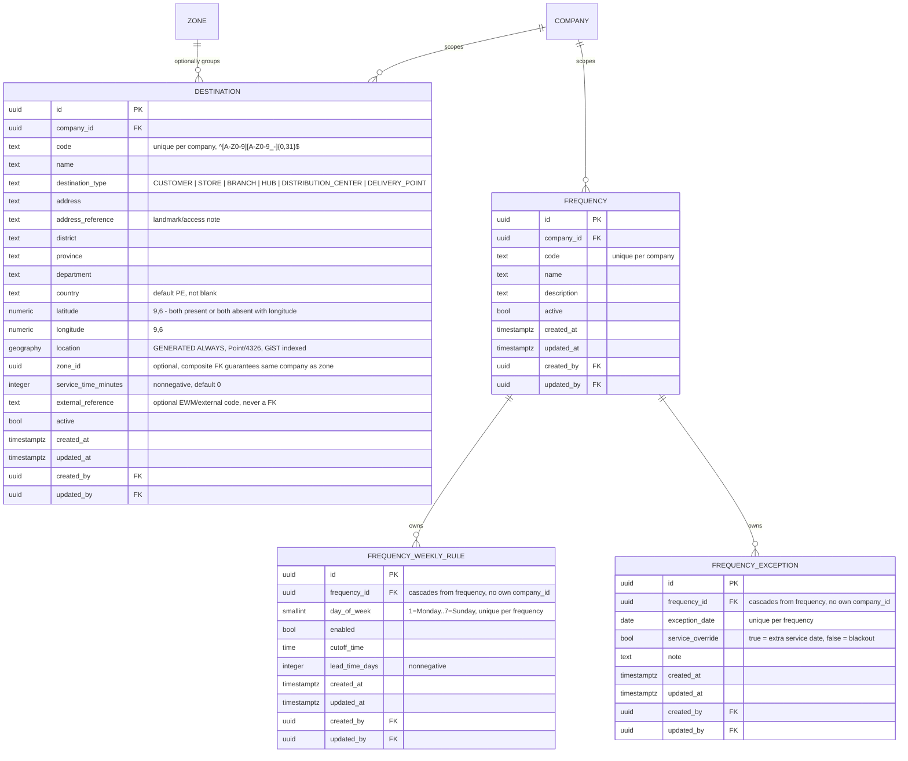
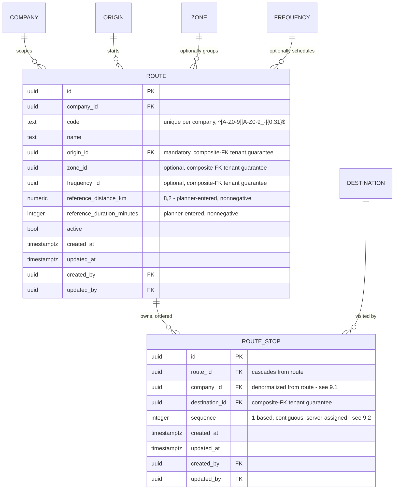
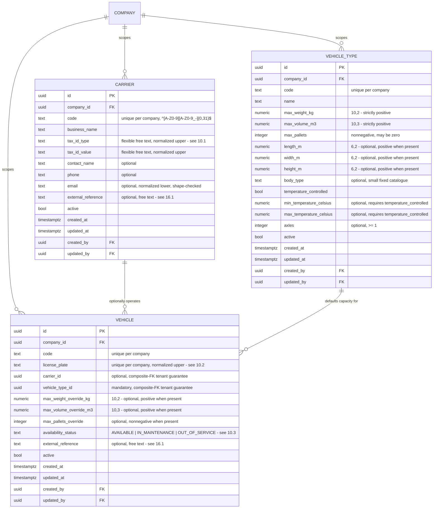
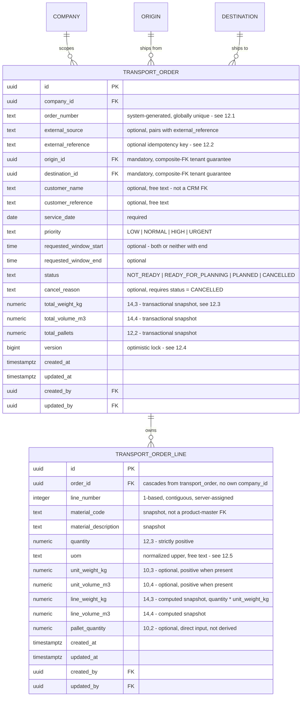
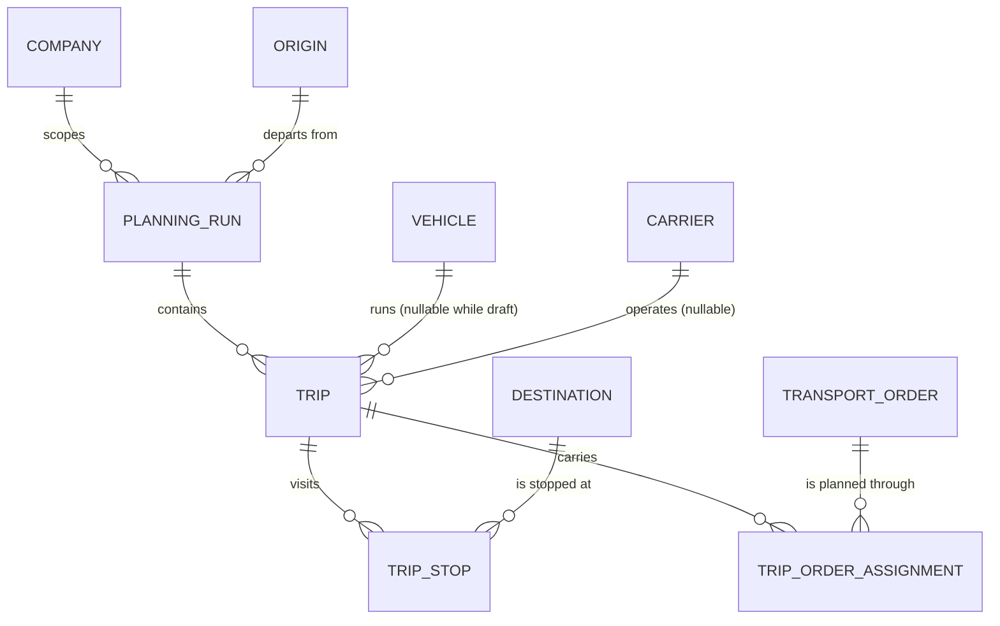
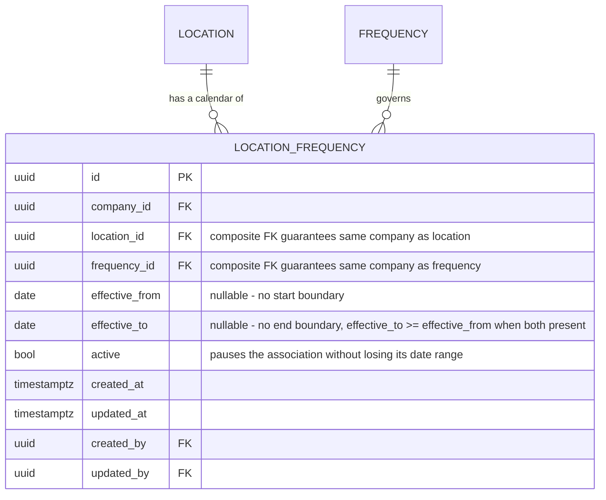

# TMS by EBIM - data model (V1 identity, tenancy and master data)

Owner: Flyway migrations under `backend/tms-api/src/main/resources/db/migration` (ADR-002).
Scope of this document: the identity/tenancy baseline (V1-V5) plus the master data tables
Step 05 onwards adds on top of it, without changing its rules.

## 1. Where the schema lives

| Object | Location | Why |
|---|---|---|
| Application tables | schema `tms` | `supabase/config.toml` exposes only `public` and `graphql_public` through the Data API, so a separate schema removes the HTTP surface entirely |
| Flyway history | `tms.flyway_schema_history` | one history, next to the objects it describes |
| PostGIS | extension in `public` | shared platform capability; V6 (Step 05) is the first migration that uses it, for `tms.origin.location` |
| Supabase `auth`, `storage` | untouched | Supabase-managed; Flyway never creates or alters them |

Consequences for the backend: `spring.flyway.default-schema=tms` and
`hibernate.default_schema=tms` are set once in `application.yml`, so entities do not repeat
the schema on every `@Table`.

## 2. Entity relationships



ASCII summary of the tenancy path used on every authenticated request:

    Supabase auth.users.id  (from the validated JWT)
              |
              v
    tms.app_user.auth_user_id -> app_user.id
              |
              v
    tms.membership  (active rows)  ->  organization_id [+ company_id | NULL]
              |
              v
    tms.membership_role -> tms.role -> tms.role_permission -> tms.permission

## 3. Design decisions and their reasons

### 3.1 Company is the operational scope, organization is the boundary

Per ADR-003. Business tables from Step 05 onwards carry `company_id` **only**.

`membership` is the single deliberate exception that carries both `organization_id` and
`company_id`, and the reason is recorded in the migration itself:

1. `company_id IS NULL` means *organization-wide* membership; without `organization_id`
   such a row could not name its tenant.
2. The composite foreign key `(company_id, organization_id) -> company (id, organization_id)`
   makes "the company must belong to this organization" a database guarantee. A single
   `company_id` column would leave that invariant to application code.

### 3.2 `app_user` is not tenant-scoped

A person may work for more than one organization, so identity is global and tenancy comes
from `membership`. `app_user` therefore has no `organization_id`.

### 3.3 No foreign key to `auth.users`

`app_user.auth_user_id` holds the Supabase Auth user id, unique and nullable, with no FK:

- Flyway must not depend on or lock the Supabase-managed `auth` schema (ADR-002);
- TMS stays portable if the identity provider changes;
- integration tests run on plain PostgreSQL, where `auth` does not exist;
- nullable because an administrator can create a profile before the invitation is accepted.

The mapping is established server-side by the backend after JWT validation (Step 03).

### 3.4 `membership_role` is a link table (refinement of ADR-003)

ADR-003 sketched a single role on the membership row. A many-to-many link is used instead
because a person frequently holds more than one role in the same company, and a single role
column would force duplicate membership rows for the same `(user, company)` pair - which
the unique indexes correctly forbid. The ADR decision (membership is the source of truth
for tenancy and role) is unchanged; only its cardinality is refined. `role.scope_level`
records whether a role belongs on an organization-wide or company-scoped membership; Java
enforces that pairing, because expressing it in SQL would need a trigger for no real gain.

### 3.5 Deletes never erase history

Every foreign key is `ON DELETE RESTRICT` except two pure configuration links:

| Link | Behaviour | Reason |
|---|---|---|
| `role_permission.role_id` | `CASCADE` | deleting a role legitimately removes its own grants |
| `membership_role.membership_id` | `CASCADE` | the link has no meaning without its membership |

Everything else - organizations with companies, companies with memberships, users that
appear in `created_by`/`updated_by` - refuses to be deleted. Long-lived rows are
**deactivated** through their `active` flag.

### 3.6 Actor columns only where an actor exists

`created_by`/`updated_by` reference `app_user` on `organization`, `company`, `app_user`,
`membership` and `membership_role`. `role` and `permission` have none: their rows are
reference data inserted by migration V3, where no actor exists. Inventing a system user to
fill the column would be worse than leaving it out.

### 3.7 `updated_at` is stamped by the database

`tms.set_updated_at()` runs `BEFORE UPDATE` on every table that has `updated_at`, so the
column is correct no matter which writer produced the change and cannot be spoofed by the
application. `now()` is the transaction timestamp, so `created_at` and `updated_at` are
equal for a row inserted and updated in the same transaction - that is intended.

The triggers deliberately carry no `WHEN (OLD.* IS DISTINCT FROM NEW.*)` filter: PostgreSQL
rejects whole-row references in a `BEFORE` trigger `WHEN` clause on tables with generated
columns, which `tms.permission` already has and the spatial tables of Steps 05/06 will have.

### 3.8 Normalization is enforced, not assumed

| Column | Rule |
|---|---|
| `organization.code`, `company.code` | `^[A-Z0-9][A-Z0-9_-]{1,31}$` |
| `role.code` | `^[A-Z][A-Z0-9_]{2,39}$` |
| `permission.resource` | dotted lower snake case, e.g. `masterdata.origin` |
| `permission.action` | lower snake case, e.g. `read`, `manage` |
| `app_user.email` | must equal `lower(btrim(email))` and match a basic address shape |
| names, `time_zone`, `tax_identifier` | not blank when present |

`company.time_zone` is only checked for blankness: a `CHECK` cannot query
`pg_timezone_names`. Java validates the IANA value.

## 4. Indexes

| Index | Purpose |
|---|---|
| `uq_organization_code` | organization codes are unique installation-wide |
| `uq_company_organization_code` | company codes unique per organization; also serves "companies of an organization" |
| `uq_company_id_organization` | target of the membership composite FK |
| `uq_app_user_email`, `uq_app_user_auth_user_id` | one profile per address, one profile per auth identity |
| `uq_membership_user_organization_company` (partial, `company_id IS NOT NULL`) | one membership per user and company |
| `uq_membership_user_organization_wide` (partial, `company_id IS NULL`) | one organization-wide membership per user |
| `ix_membership_app_user_active` (partial, `active`) | the hot path: JWT -> app_user -> active memberships |
| `ix_membership_company`, `ix_membership_organization` | administration screens: who may act here |
| `ix_role_permission_permission`, `ix_membership_role_role` | reverse lookups and impact analysis |
| `uq_permission_resource_action`, `uq_permission_code` | one row per capability, one stable string form |

Two partial unique indexes are used instead of `UNIQUE NULLS NOT DISTINCT` so the intent is
explicit and does not depend on a PostgreSQL 15+ behaviour change.

## 5. Reference data shipped by migrations

Migration V3 inserts the authorization catalogue - and nothing else. No organization, no
company, no user, no membership, no credential.

| Role | Scope | Grants |
|---|---|---|
| `ORGANIZATION_ADMIN` | ORGANIZATION | all 29 permissions |
| `COMPANY_ADMIN` | COMPANY | all except `iam.organization:manage` |
| `PLANNER` | COMPANY | reads company, master data and fleet; manages `orders.order` and `planning.trip` |
| `VIEWER` | COMPANY | read-only on company, master data, fleet, orders and trips |

Permissions cover the V1 modules only: `iam.*`, `masterdata.*`, `fleet.*`, `orders.order`,
`planning.trip`, `audit.log`. `audit.log` has a `read` permission and deliberately no
`manage`: the audit trail is append-only.

Demo tenants and users live in `supabase/seeds/local_dev_seed.sql`, outside the migration
history, and are verified by `LocalSeedIntegrationTest`.

## 6. What the tests prove

`backend/tms-api/src/test/java/com/ebim/tms/database/`:

| Test | Proves |
|---|---|
| `FlywayMigrationIntegrationTest` | the history applies to an empty database, validates, is idempotent, replays deterministically, and PostGIS is present |
| `TenancyConstraintIntegrationTest` | company code scoping, cross-organization membership refusal, membership uniqueness, RESTRICT deletes, cascade limits, email/code normalization, `updated_at` trigger, seeded catalogue |
| `SchemaExposureIntegrationTest` | RLS enabled on every table (including `origin`/`zone` since V6, `destination`/`frequency`/`frequency_weekly_rule`/`frequency_exception` since V7, `route`/`route_stop` since V8, and `carrier`/`vehicle_type`/`vehicle` since V9, `transport_order`/`transport_order_line` since V10, and `planning_run`/`trip`/`trip_stop`/`trip_order_assignment` since V11), no policies, not forced, PUBLIC and Supabase API roles denied, nothing published in `public` |
| `MasterDataConstraintIntegrationTest` | origin/zone code uniqueness is per-company, not installation-wide; FK to a real company; code normalization; the latitude/longitude pair and range checks; the generated `location` column reflects a valid pair and is `NULL` when coordinates are absent; `origin_type` is restricted to the catalogue; defaults and actor columns |
| `MasterDataDestinationFrequencyConstraintIntegrationTest` | the same class of proof as above, extended to V7: destination/frequency code uniqueness per company; destination coordinate pair/range checks and generated `location`; `destination_type` and nonnegative `service_time_minutes`; a destination's `zone_id` must belong to its own company even though the two FK columns are separate; weekly rule `day_of_week` range and per-frequency uniqueness and nonnegative `lead_time_days`; weekly rules and exceptions cascade-delete with their frequency; exception date uniqueness and non-blank note |
| `MasterDataRouteConstraintIntegrationTest` | the same class of proof, extended to V8: route code uniqueness per company; a route's origin/zone/frequency must belong to its own company even though the FK columns are separate; nonnegative reference distance/duration; a route stop's destination and company must both match its route; positive sequence; a destination cannot appear twice on one route; stops cascade-delete with their route; **the `DEFERRABLE INITIALLY DEFERRED` sequence constraint** - a two-stop in-place swap survives `COMMIT`, and a genuine unresolved duplicate still fails, just at `COMMIT` instead of at the statement |
| `FleetConstraintIntegrationTest` | the same class of proof, extended to V9: carrier/vehicle-type/vehicle code uniqueness per company; carrier tax-id pair uniqueness and normalization; carrier email normalization/shape when present; vehicle-type `max_weight_kg`/`max_volume_m3` strictly positive and `max_pallets` nonnegative-including-zero; optional dimensions positive when present; `body_type` restricted to the catalogue; the temperature-range coherence rule (requires `temperature_controlled`, `min <= max`); vehicle license-plate normalization/shape and per-company uniqueness; a vehicle's carrier and vehicle type must both belong to the vehicle's own company even though the FK columns are separate; override capacities positive/nonnegative when present; `availability_status` restricted to the catalogue; defaults and actor columns |
| `OrderConstraintIntegrationTest` | the same class of proof, extended to V10: `order_number` uniqueness is global (section 12.1) while the external-reference pair is per-company and partial (section 12.2); a reference with no source is rejected; an order's origin/destination must belong to its own company even though the FK columns are separate; time-window pair/order checks; `priority`/`status` restricted to their catalogues; `cancel_reason` requires `status = CANCELLED`; totals nonnegative; a line's quantity strictly positive, `uom` normalized, unit weight/volume positive when present, line number unique per order; lines cascade-delete with their order; defaults and actor columns |
| `PlanningConstraintIntegrationTest` | the same class of proof, extended to V11: an order has at most one **open whole-order assignment** across every trip, a closed one frees it again and both rows survive, and a `whole_order = false` allocation is deliberately outside the index (section 14.4); two concurrent transactions assigning the same order - the second blocks until the first commits, then fails; an assignment's trip and order must belong to its own company; the removal stamp is coherent in both directions; a `CONFIRMED` trip must carry a vehicle, a departure and its frozen capacity while a draft may carry none of them (section 14.5); a trip's vehicle must be its own company's; trip numbers unique per run; one open draft run per company/origin/date, freed by confirming or cancelling; `plan_number` globally unique; a run's origin must be its own company's; a stop's destination must be its own company's; one stop per destination; **the `DEFERRABLE` stop-sequence constraint** - an in-place reorder survives `COMMIT` while a genuine duplicate still fails at it; stops cascade-delete with their trip and a service window must be a real window |
| `ApplicationDatabaseStartupIntegrationTest` | the real Spring context boots with datasource + JPA + Flyway against PostgreSQL |
| `LocalSeedIntegrationTest` | the local seed still matches the schema and carries no credential |
| `MigrationConventionTest` | naming, contiguous versions, no destructive DDL, no `auth`/`storage` DDL, no tenant data in migrations, no `supabase/migrations` |

The origin/zone vertical slice itself (controller through repository, company scoping,
permissions) is proven end to end by
`backend/tms-api/src/test/java/com/ebim/tms/masterdata/api/OriginZoneApiIntegrationTest.java`
rather than repeated in the database-level test above - see
`docs/overnight/05_ORIGINS_ZONES.md` section 4 for that coverage. The destination/frequency
slice (Step 06) is proven the same way by
`backend/tms-api/src/test/java/com/ebim/tms/masterdata/api/DestinationFrequencyApiIntegrationTest.java`
- see `docs/overnight/06_DESTINATIONS_FREQUENCIES.md` section 3 for that coverage. The route
slice (Step 07) is proven the same way by
`backend/tms-api/src/test/java/com/ebim/tms/masterdata/api/RouteApiIntegrationTest.java` - see
`docs/overnight/07_ROUTES.md` section 5 for that coverage. The fleet slice (Step 08) is proven
the same way by `backend/tms-api/src/test/java/com/ebim/tms/fleet/api/FleetApiIntegrationTest.java`
- see `docs/overnight/08_FLEET.md` section 5 for that coverage. The orders slice (Step 09) is
proven the same way by `backend/tms-api/src/test/java/com/ebim/tms/orders/api/OrderApiIntegrationTest.java`
- see `docs/overnight/09_ORDERS.md` for that coverage.

## 7. Master data: origins and zones (Step 05, migration V6)

The first business masters built on top of the V1-V5 baseline, following every rule section 8
sets for the migrations after it unchanged: `company_id NOT NULL` with an FK to `tms.company` and an index
leading with it, `created_at`/`updated_at` plus the `set_updated_at` trigger, actor columns
(a real actor - the authenticated caller - exists for both tables), RLS enabled in the same
migration, and a normalized-code `CHECK` rather than convention alone.



### 7.1 `location` is generated, not written

`tms.origin.location` is `GENERATED ALWAYS AS (ST_SetSRID(ST_MakePoint(longitude, latitude),
4326)::geography) STORED`. Neither JPA nor the API ever populate it: `Origin` (the entity)
does not map the column at all, so create/update stay ordinary numeric-column CRUD
(architecture section 8's requirement) while the database derives the spatial value for a
future nearest-origin/within-radius query. `ST_MakePoint` propagates `NULL`, so an origin
with no coordinates simply has a `NULL` location - no `CASE` needed, and
`ck_origin_coordinates_pair` guarantees latitude/longitude are never half-set. `ix_origin_location`
is a GiST index maintained on every write starting now, so a later step's spatial query does
not need a second migration to add one retroactively.

### 7.2 `external_reference` is the EWM boundary, not a foreign key

Per the repository's independence rule (no shared internal tables or cross-product FKs
between TMS and EWM), `origin.external_reference` is a free-text optional column - a place to
record a future EWM warehouse id or similar - never a foreign key into another product's
schema. Nothing reads or validates it against an external system in V1.

### 7.3 Zones stay attribute-only in V1

`tms.zone` intentionally carries no geometry: code, name, optional description, active,
audit. The step brief asked for zone geofencing to be *possible* later without forcing
polygons in now; a future migration can add a nullable geometry column to this same table
without changing its shape or breaking existing rows, exactly like `location` was added to
`origin` without touching `organization`/`company`.

### 7.4 Indexes added by V6

| Index | Purpose |
|---|---|
| `uq_origin_company_code`, `uq_zone_company_code` | codes unique per company, free to repeat across companies (ADR-003) |
| `ix_origin_company`, `ix_zone_company` | the hot path: "list mine", company-scoped queries lead with `company_id` |
| `ix_origin_location` (GiST) | future spatial queries against `location`; not yet queried in V1, maintained from day one |

## 8. Master data: destinations and frequencies (Step 06, migration V7)

Follows V6's shape unchanged (section 9 below): `company_id NOT NULL` with an FK and a
leading index, actor columns, RLS enabled in this same migration, normalized-code `CHECK`s.



### 8.1 `destination.zone_id` reuses the composite-FK idiom, not a new one

A destination's zone must belong to the destination's own company. Rather than trusting
application code alone, migration V7 adds `tms.zone.uq_zone_id_company UNIQUE (id,
company_id)` and a composite FK `fk_destination_zone_company FOREIGN KEY (zone_id,
company_id) REFERENCES tms.zone (id, company_id)` - the exact pattern `tms.membership` (V2)
uses for `company_id`/`organization_id`. `MATCH SIMPLE` (the default) means the FK is
satisfied whenever `zone_id IS NULL`, so an optional zone stays optional. Java (`
DestinationService.requireZoneInScope`) is still the primary check - it is what turns a
mismatch into a clean 400 instead of a raw constraint violation - the database constraint is
defense in depth for the same reason RLS is (architecture section 4.2).

### 8.2 Frequency is a header plus two owned child collections, not hardcoded booleans

The step brief is explicit that five or seven boolean columns on `frequency` would not be
future-friendly. `frequency_weekly_rule` carries the Monday-Sunday cadence (one row per
configured day, `enabled` plus optional `cutoff_time`/`lead_time_days`) and
`frequency_exception` carries date-specific overrides (an extra pickup or a blackout) -
completely separate concerns that can each evolve without touching the other or the header.
Both children cascade from `frequency` and carry no `company_id` of their own, the same shape
`tms.membership_role` uses as a pure child of `tms.membership` (V2): "the row has no meaning
without its parent."

`FrequencyService.update` replaces the whole weekly-rule set inside the same transaction as
the header update (`Frequency.replaceWeeklyRules`, diff by `day_of_week`: update a day
present in both the request and the database, add a new day, and let Hibernate's
`orphanRemoval` delete a day the request no longer includes) - so a rule can never be left
half-replaced or orphaned. Exceptions are not diffed as a set: each is created or deleted
individually through its own sub-resource (`POST`/`DELETE
/masterdata/frequencies/{id}/exceptions`), because a calendar override is an independent fact
about one date, not a slot in a fixed weekly grid.

### 8.3 A destination-frequency association table was deliberately not added in V7

The "Frequency model" brief recommends an explicit destination-frequency association (rather
than a rigid single FK) so multiple schedules can be modeled later. V7 does not add that
table: neither the Destinations nor the Frequencies frontend section of the brief asks for an
assignment screen, and nothing in Orders/Planning (not built yet) has a concrete requirement
for it. Building the join table now, with no reachable API and no screen, would be exactly
the speculative complexity the repository instructions ask to avoid - the same judgment V6
already made for zone geometry ("no geometry in V1... a future migration can add it without
changing this shape"). When Orders/Planning defines what "which frequency serves this
destination" needs to look like, add the table then; `destination`/`frequency` are already
shaped so a later join table can reference both without any change to either.

**Superseded by section 15.** Job 03 of the overnight-v3 pack is that concrete requirement, and
`tms.location_frequency` (migration V15) is that table - associating the canonical `tms.location`
(V14) rather than the legacy `tms.destination`, since V14 postdates this paragraph.

### 8.4 Indexes added by V7

| Index | Purpose |
|---|---|
| `uq_destination_company_code`, `uq_frequency_company_code` | codes unique per company, free to repeat across companies (ADR-003) |
| `ix_destination_company`, `ix_frequency_company` | the hot path: "list mine", company-scoped queries lead with `company_id` |
| `ix_destination_zone` (partial, `zone_id IS NOT NULL`) | "destinations in this zone" without indexing the common no-zone case |
| `ix_destination_location` (GiST) | future spatial queries against `location`, matching `ix_origin_location` (V6) |
| `ix_frequency_weekly_rule_frequency`, `ix_frequency_exception_frequency` | "rules/exceptions of this frequency", the only way either child table is ever queried |
| `uq_zone_id_company` (on `tms.zone`) | composite-FK target for `destination.zone_id`, see section 8.1 |

## 9. Master data: routes (Step 07, migration V8)

Follows V6/V7's shape unchanged (section 10 below): `company_id NOT NULL` with an FK and a
leading index, actor columns, RLS enabled in this same migration, normalized-code `CHECK`s.



A master `tms.route` is a reusable planned corridor - company-scoped origin plus the ordered
`tms.route_stop` destinations - and is deliberately distinct from a future dynamically
calculated Trip route (deferred by decision, per the repository's OR-Tools/route-optimization
deferral): no geometry, no live position, no optimizer output, just a named sequence a planner
sets up once and a Trip can point at later.

### 9.1 `route_stop` carries its own `company_id`, unlike every other pure child so far

`tms.frequency_weekly_rule` and `tms.frequency_exception` (V7) are pure children of their
parent with no `company_id` of their own, because neither references another company-scoped
table. `tms.route_stop` is different: it references `tms.destination`, another company-scoped
table, which section 10 rule 6 requires a composite-FK tenant guarantee for - and that
guarantee needs `company_id` on the *referencing* row, not just the parent. So `route_stop`
denormalizes `company_id` from its route and carries two composite FKs: `(route_id,
company_id) -> route (id, company_id)` (the stop's company must match its own route's company)
and `(destination_id, company_id) -> destination (id, company_id)` (the stop's destination
must belong to that same company). This is the refinement rule 7 below captures: being a pure
child (no lifecycle without its parent) and needing its own `company_id` are independent
questions, not the same one.

`tms.route` itself needs the identical guarantee for `origin_id` (mandatory) and the optional
`zone_id`/`frequency_id`, reusing `tms.zone.uq_zone_id_company` (V7) and adding
`uq_origin_id_company`/`uq_frequency_id_company` in this migration.

### 9.2 Stop order is server-assigned from array order, not a client-supplied number

`RouteRequest.destinationIds` is the whole ordered stop list; the server assigns
`sequence = 1..N` from the array's position (`Route.replaceStops`), so a request can never ask
for a duplicate or gapped sequence - "sequence starting at a consistent convention" from the
step brief is satisfied by construction rather than by validating a client-supplied number.
Reordering (the frontend's move up/down) resends the whole list in its new order and is applied
as an update-only diff keyed by `destination_id` (`Route.replaceStops`, the same
diff-and-replace-via-`orphanRemoval` shape `Frequency.replaceWeeklyRules` (V7) established), not
a delete-then-insert.

That diff necessarily passes a swap (two stops trading positions) through a transient duplicate
`(route_id, sequence)` pair mid-transaction. `uq_route_stop_route_sequence` is declared
`DEFERRABLE INITIALLY DEFERRED` so PostgreSQL checks it at `COMMIT` instead of at each
statement - the standard idiom for a reorderable unique-position list. See the V8 migration
comment on that constraint and `MasterDataRouteConstraintIntegrationTest` (which proves both
that a legitimate swap survives commit and that a genuine unresolved duplicate still fails, just
later) for the two-sided proof of this decision.

### 9.3 A destination may appear at most once per route

`uq_route_stop_route_destination UNIQUE (route_id, destination_id)` forbids a route from
stopping at the same destination twice. Documented decision, matching how the step brief asks
duplicates to be "explicitly forbidden or intentionally supported with a documented reason": a
master Route in V1 is a corridor of distinct stops; a legitimate "visit the same place twice"
itinerary belongs to Trip-level planning (not built yet), not a reusable master. Revisit only if
a concrete round-trip use case appears - the same bar section 8.3 sets for the deferred
destination-frequency association table.

### 9.4 List and detail deliberately return different shapes

The step brief is explicit that a route list must not load every destination for each row
(N+1). `RouteService.list` therefore never touches any route's `stops` collection; it resolves a
stop *count* per page with one batched `GROUP BY` query
(`RouteStopRepository.countByRouteIds`) and returns `RouteView` (count only). `RouteService.get`
(and create/update/activate/deactivate) returns `RouteDetailView`, which does include the
ordered stops with each one's resolved destination - fetched with the same batched
`findAllById` discipline `DestinationService.loadZones` (V7) established for a single route's
stop set, never one query per stop.

### 9.5 Deactivating an origin or destination does not erase route history

Deactivation only flips the `active` boolean; the row is never deleted, so every FK a route or
route stop holds remains valid and the composite-FK tenant guarantees keep working. A route (or
a route editor screen) can therefore keep resolving and displaying a stop whose destination has
since been deactivated - `RouteFormModal` on the frontend prefers the route's own
`destinationCode`/`destinationName` over the active-only dropdown fetch for exactly this reason.

### 9.6 Indexes added by V8

| Index | Purpose |
|---|---|
| `uq_route_company_code` | codes unique per company, free to repeat across companies (ADR-003) |
| `ix_route_company` | the hot path: "list mine", company-scoped queries lead with `company_id` |
| `ix_route_origin`, `ix_route_zone` (partial), `ix_route_frequency` (partial) | reverse lookups and the list filters |
| `ix_route_stop_route`, `ix_route_stop_destination` | "stops of this route" (the only way `route_stop` is queried per-route) and "routes touching this destination" |
| `uq_route_id_company` (on `tms.route`) | composite-FK target for `route_stop.route_id` |
| `uq_origin_id_company` (on `tms.origin`), `uq_destination_id_company` (on `tms.destination`), `uq_frequency_id_company` (on `tms.frequency`) | composite-FK targets `route`/`route_stop` need - the first cross-table references either table has had |

## 10. Fleet masters: carriers, vehicle types and vehicles (Step 08, migration V9)

Follows V6/V7/V8's shape unchanged (section 11 below): `company_id NOT NULL` with an FK and a
leading index, actor columns, RLS enabled in this same migration, normalized-code `CHECK`s, and
the composite-FK tenant guarantee (rule 6) for `tms.vehicle`'s references into `tms.carrier` and
`tms.vehicle_type`.



### 10.1 `carrier.tax_id_type`/`tax_id_value` are a flexible pair, not a fixed enum

Unlike `origin_type`/`destination_type` (a small catalogue enforced with `CHECK ... IN (...)`),
a carrier's legal/tax identification is deliberately free text: identifier types vary by country
(RUC in Peru, RFC in Mexico, CNPJ in Brazil, EIN in the US, ...), and hardcoding a per-country
catalogue would either force TMS to add a migration for every new operating country or force an
awkward `OTHER` bucket. Both halves are still normalized (`upper(btrim(...))`, per section 3.8 -
"normalization is enforced, not assumed") so `uq_carrier_company_tax_id UNIQUE (company_id,
tax_id_type, tax_id_value)` actually catches `'ruc'`/`'RUC'` as the same type instead of letting
normalization drift create a duplicate the constraint cannot see.

### 10.2 A vehicle's license plate is unique per company, not installation-wide

A license plate is a real-world identifier a planner would expect to be globally unique - but
`uq_vehicle_company_license_plate` scopes it to `company_id` anyway, matching every other
master's code uniqueness (ADR-003) rather than carving out a special case. Two reasons:

1. **Consistency with the tenancy model.** Every other uniqueness rule in this document is
   company-scoped; a single globally-unique column would be a one-off exception with no
   corresponding capability (V1 has no installation-wide fleet registry).
2. **A global constraint is a cross-tenant information leak.** If plate uniqueness were
   enforced across companies, company A could learn whether company B has a vehicle with a
   specific plate simply by attempting to register it and observing a 409 instead of success -
   the same class of leak the rest of the API avoids by answering a cross-company read with 404,
   never 403 or 409 (see `RouteApiIntegrationTest.crossCompanyAccessIsBlocked` and its fleet
   equivalent, `FleetApiIntegrationTest.Vehicles.crossCompanyAccessIsBlocked`).

If a genuine cross-company fleet registry becomes a requirement, it is a new, explicitly
designed capability - not a side effect of tightening this constraint.

### 10.3 `vehicle.availability_status` is a current-state flag, not a scheduling calendar

The step brief asks for "availability baseline that does not pretend to be a full scheduling
calendar." `availability_status` is one column with three values (`AVAILABLE`,
`IN_MAINTENANCE`, `OUT_OF_SERVICE`) recording the vehicle's current operational state - not a
calendar of future slots, shifts or bookings. Trip/planning-level scheduling (deferred - not
built in V1) is a separate, later concern; this column intentionally does not anticipate its
shape.

### 10.4 Effective capacity is resolved in Java, not stored

`tms.vehicle`'s three override columns (`max_weight_override_kg`, `max_volume_override_m3`,
`max_pallets_override`) are independently nullable - a vehicle may override one, two, or all
three dimensions and fall back to its `tms.vehicle_type`'s defaults for the rest. Nothing in the
schema materializes the *resolved* value: `EffectiveCapacityResolver`
(`com.ebim.tms.fleet.application`) is the single place that computes it (vehicle override first,
otherwise the type default, per dimension), used by every read (`VehicleView.effectiveMaxWeightKg`
etc.) and available for Planning's future capacity checks
(`docs/architecture/OWNERSHIP_MATRIX.md`, "Capacity checks") without a second implementation of
the same rule.

### 10.5 Indexes added by V9

| Index | Purpose |
|---|---|
| `uq_carrier_company_code`, `uq_vehicle_type_company_code`, `uq_vehicle_company_code` | codes unique per company, free to repeat across companies (ADR-003) |
| `uq_carrier_company_tax_id` | a legal identifier is registered once per company - section 10.1 |
| `uq_vehicle_company_license_plate` | a plate is registered once per company - section 10.2 |
| `ix_carrier_company`, `ix_vehicle_type_company`, `ix_vehicle_company` | the hot path: "list mine", company-scoped queries lead with `company_id` |
| `ix_vehicle_carrier` (partial, `carrier_id IS NOT NULL`) | "vehicles of this carrier" without indexing the common owned-fleet case |
| `ix_vehicle_type` | "vehicles of this type", the list filter and the capacity-resolution lookup |
| `uq_carrier_id_company` (on `tms.carrier`), `uq_vehicle_type_id_company` (on `tms.vehicle_type`) | composite-FK targets `vehicle.carrier_id`/`vehicle.vehicle_type_id` need |

## 12. Orders (Step 09, migration V10)

Follows V6-V9's shape unchanged (section 13 below): `company_id NOT NULL` with an FK and a
leading index, actor columns, RLS enabled in this same migration, the composite-FK tenant
guarantee (rule 6) for `tms.transport_order`'s references into `tms.origin` and
`tms.destination`. Table names avoid the reserved word `ORDER`: `tms.transport_order` /
`tms.transport_order_line`, per the step brief's own suggestion. The full status lifecycle is
documented in `docs/domain/ORDER_LIFECYCLE_V1.md`, not repeated here.



### 12.1 `order_number` is the one uniqueness rule that is deliberately *not* company-scoped

Rule 9 (section 13) requires uniqueness to scope to `company_id`, even for a real-world-unique
value, because a global constraint on a value a *user chooses* lets one company probe whether
another company has registered a specific value. `order_number` is different in kind: it is
generated once, by the backend, from `tms.transport_order_number_seq`
(`OrderService.generateOrderNumber`, formatted `TO-00000001`) - nobody ever supplies or guesses
one to "attempt" a collision, so a global `UNIQUE (order_number)` carries none of rule 9's
cross-tenant leak risk. It is intentionally an exception to rule 9, not a violation of it.

### 12.2 The external-reference idempotency pair

`external_source`/`external_reference` model "this order was already created by that upstream
system, for that external id" - the step brief's idempotency/external-reference uniqueness
strategy. Both are optional (a manually created order has neither), but
`ck_transport_order_external_pair_complete` forbids a reference with no source, so
`uq_transport_order_external UNIQUE (company_id, external_source, external_reference) WHERE
external_reference IS NOT NULL` can never be defeated by two different-but-both-NULL sources -
the same reasoning `carrier`'s `tax_id_type`/`tax_id_value` pair (section 10.1) needed, applied
to a nullable pair instead of a mandatory one. V1 treats this as a uniqueness guard
(`OrderService.create` rejects a duplicate pair with 409, `ConflictException`), not a
return-prior-result idempotent replay cache - the same "add the fuller behaviour only when a
concrete integration needs it" judgment section 8.3 made for a destination-frequency
association table.

### 12.3 Header totals are a documented transactional snapshot, not a live aggregate

Planning (step 10, not built yet) needs fast, stable weight/volume/pallet totals per order to
check capacity against a vehicle without summing lines on every read. `total_weight_kg`/
`total_volume_m3`/`total_pallets` are safe to persist as a snapshot only because exactly one
thing ever writes `transport_order_line`: `TransportOrder.applyLines`, called from inside the
same transaction and the same method that recomputes all three totals from the line set it just
wrote (`TransportOrder.recomputeTotals`). There is no code path - no controller, no job, no raw
repository call - that changes a line without also updating the header snapshot in the same
flush; `OrderApiIntegrationTest` proves recomputation directly (add a line, remove a line,
change a quantity - the header always matches the sum). If a second
writer of order lines is ever introduced (a future EDI importer that bypasses `OrderService`,
for instance), it must call the same recomputation path - the snapshot is not safe against a
second, uncoordinated writer.

### 12.4 `version` is the first optimistic-locking column in the schema

The step brief asks for "optimistic locking/versioning where concurrent edits matter" - the
first module in this repository where two people plausibly edit the same row through separate
HTTP round trips. `OrderRequest.version` is required on update and is compared explicitly by
`OrderService.requireCurrentVersion` against the persisted order's version *before* any change
is applied, which is what actually catches the realistic case (a client editing a stale copy
loaded before someone else's change landed) - JPA's own `@Version` check over this column
(`jakarta.persistence.Version` on `TransportOrder.version`) is kept as a second, narrower
backstop for two transactions racing to flush at the same instant, which the explicit check
alone would not catch. Both paths translate to the same `ConflictException`
(`OrderService.saveOrConflict`, `ApiExceptionHandler.handleOptimisticLockingFailure`). A future
module that needs the same guarantee should follow this two-layer shape rather than relying on
`@Version` alone.

### 12.5 `uom` is free text, matching `carrier.tax_id_type`'s reasoning

Unit-of-measure vocabularies vary by ERP/customer (`EA`, `KG`, `BOX`, `PAL`, ...); a fixed
`CHECK ... IN (...)` catalogue would hardcode one system's vocabulary the same way a fixed
tax-id-type catalogue would have (section 10.1). `uom` is normalized (`upper(btrim(uom))`) but
not restricted to a fixed set.

### 12.6 `orders` resolves origin/destination through a port, not through `masterdata` directly

`ModuleBoundaryTest` forbids any business module from depending on another (`orders` must not
import `com.ebim.tms.masterdata`), but a transport order genuinely needs to validate and display
a `masterdata`-owned origin and destination. `com.ebim.tms.shared.reference` defines two small
ports (`OriginLookupPort`, `DestinationLookupPort`) that carry no `masterdata` type; `masterdata`
provides the only implementation (`OriginLookupAdapter`, `DestinationLookupAdapter`,
`masterdata.infrastructure`), and `orders.application.OrderService` depends only on the port
interfaces. This is the "explicit API" `ModuleBoundaryTest`'s own rule message points to - see
that test and `ArchitectureTest` for the enforcement, and rule 10 (section 13) for the pattern
generalized for the next module that needs it (Planning, referencing fleet vehicles/carriers and
orders themselves).

### 12.7 Indexes added by V10

| Index | Purpose |
|---|---|
| `uq_transport_order_number` | `order_number` is globally unique - see 12.1 |
| `uq_transport_order_external` (partial) | the idempotency pair - see 12.2 |
| `ix_transport_order_company` | the hot path: "list mine", company-scoped queries lead with `company_id` |
| `ix_transport_order_company_status`, `ix_transport_order_company_service_date` | the list screen's status/date filters, composed with the company scope that always applies |
| `ix_transport_order_origin`, `ix_transport_order_destination` | the list screen's origin/destination filters |
| `uq_transport_order_id_company` (on `tms.transport_order`) | composite-FK target for a future Planning trip-assignment table (rule 6) |
| `ix_transport_order_line_order` | "lines of this order", the only way `transport_order_line` is ever queried |
| `uq_transport_order_line_order_line_number` | one line number per order |

## 13. Rules for the next migrations

1. Business tables carry `company_id NOT NULL` with an FK to `tms.company` and an index
   that leads with it. Never both scope columns without a documented reason - a pure child
   of another business table (no meaning without its parent, like `membership_role` or
   `frequency_weekly_rule`) is the one documented exception.
2. New tables get `created_at`, `updated_at`, the `set_updated_at` trigger, and actor
   columns when a real actor exists.
3. New tables are added to the `ENABLE ROW LEVEL SECURITY` list in the same migration.
4. Spatial columns follow `docs/database/MIGRATION_STRATEGY.md` section on PostGIS.
5. Every vertical slice adds a cross-tenant isolation test (ADR-003 compliance rule).
6. A foreign key from one company-scoped table into another (like `destination.zone_id`)
   gets the composite-FK tenant guarantee from section 8.1, not just a same-column FK.
7. Being a pure child of another table (rule 1's exception) and needing your own `company_id`
   (rule 6) are independent questions. A child table that *itself* references another
   company-scoped table needs `company_id` denormalized from its parent so it can carry rule
   6's composite FK too - see section 9.1 (`route_stop`), which needs both.
8. A reorderable unique-position column (a list a user can drag/move) declares its uniqueness
   constraint `DEFERRABLE INITIALLY DEFERRED` so an update-only reorder diff can pass through
   a transient duplicate mid-transaction without failing - see section 9.2
   (`uq_route_stop_route_sequence`).
9. A uniqueness rule always scopes to `company_id`, even for a column that describes a
   real-world-unique thing (a license plate, a legal tax id) - never installation-wide. A
   global constraint would leak cross-tenant existence information through a conflict
   response; see section 10.2. The one documented exception is a value nobody chooses or
   guesses, like a system-generated sequential number - see section 12.1.
10. A business module that needs to resolve a row owned by another business module (not a
    pure lookup value like an enum) does so through a small port interface in
    `com.ebim.tms.shared.reference` (or a similarly-scoped `shared` subpackage), implemented
    by an adapter inside the owning module - never by importing the owning module's
    repository or entity directly. See section 12.6 (`OriginLookupPort`/
    `DestinationLookupPort`) - the pattern to reuse when Planning (step 10) needs to resolve
    fleet vehicles/carriers or orders.
11. A table whose rows are plausibly edited by two different HTTP requests in separate round
    trips (not just raced within one) gets a `bigint version` column
    (`jakarta.persistence.Version`) plus an explicit "does the request's version match the
    persisted version" check in the service *before* any field is changed - relying on JPA's
    `@Version` alone only catches two transactions racing to flush at the same instant, not a
    client submitting a stale form. See section 12.4.

12. An invariant that spans two rows of the same table - "at most one open X per Y" - is
    expressed as a **partial unique index** over exactly the shape the current version writes,
    plus a service-level pre-check that exists only to produce a readable message. The index is
    what actually holds under concurrency; the pre-check is what makes the common case friendly.
    Scope the `WHERE` clause so it constrains today's shape without foreclosing tomorrow's - see
    section 14.4 (`uq_trip_order_assignment_open_whole_order`), which excludes closed history rows
    so a reassignment is legal and excludes partial allocations so a future split is not blocked.
    A partial index cannot be `DEFERRABLE`, so a transaction that supersedes such a row must close
    the old one and flush before inserting the new one (rule 8's problem, solved by statement
    order instead).
13. A row that is superseded is **closed, not overwritten or deleted**: a status column plus
    `*_at`/`*_by`/`*_reason` stamps, and every query that means "what is in force now" filters on
    the status (with a partial index on it, so history never slows the hot path). See section 14.3
    (`trip_order_assignment`) - the concrete form of section 3.5's "deletes never erase history"
    for a table whose rows are replaced rather than deactivated.

V6 (Step 05) is the first migration to follow rules 1-5 against a real business table; V7
(Step 06) is the first to need rule 6. V8 (Step 07) is the first to need rules 7-8. V9
(Step 08) is the first to need rule 9 explicitly, though it was implicit in every prior
company-scoped unique constraint. V10 (Step 09) is the first to need rule 9's documented
exception and the first to need rules 10-11. V11 (Step 10) is the first to need rules 12-13,
and reuses 6-11 unchanged; its own model is section 14, which follows this section so that the
rule numbering stays stable for the references that already point at it. Step 11 onward should
match this shape rather than reinvent it.

## 14. Manual planning: runs, trips, stops and assignments (Step 10, migration V11)

Four tables, all following section 13's rules 1-11 unchanged, plus the two new rules (12-13) that
V11 is the first to need. The domain contract is `docs/domain/PLANNING_MANUAL_V1.md`; the capacity
rules are `docs/domain/CAPACITY_MODEL.md`.



### 14.1 A trip inherits its run's origin instead of repeating it

`tms.trip` has no `origin_id`. Every trip of a run departs from that run's origin, so the step
brief's "company/origin consistency" is structural: there is no second copy that could disagree.
Its `company_id` *is* denormalized from the run, because rule 7 requires it - a trip references
`tms.vehicle` and `tms.carrier`, both company-scoped, and needs its own `company_id` to carry
rule 6's composite foreign keys into them.

### 14.2 A planning run stores no counters

`planning_run` has no `trip_count`, no `order_count` and no totals. Section 12.3 documents why an
order's header totals are safe to persist - the backend is the sole writer of the lines they
summarise, and both change in one transaction. A run's counts fail that test: they change through a
*different* aggregate (assignments on trips) on nearly every request, so a stored counter would buy
one query per page and cost a permanent drift risk. `TripRepository.countByPlanningRunIds` and
`TripOrderAssignmentRepository.countByPlanningRunIds` return them in one grouped query per page.

### 14.3 The assignment aggregate, and why not `transport_order.trip_id`

`tms.trip_order_assignment` is an explicit aggregate rather than a foreign key on the order,
because a `trip_id` column could not do three things (full reasoning in
`docs/domain/PLANNING_MANUAL_V1.md` section 3):

1. **Carry allocated quantities.** `assigned_weight_kg`/`assigned_volume_m3`/`assigned_pallets` are
   snapshotted from the order header at assignment time, and the capacity service sums *these*,
   never the order. A future partial assignment is therefore a second row with smaller numbers and
   `whole_order = false`, with no change to any capacity code and no schema migration of existing
   rows. The optional `trip_order_line_allocation` table is deliberately not created in V1: it
   would have no writer. It hangs off `trip_order_assignment.id` + `transport_order_line.id` when
   line-level allocation actually arrives.
2. **Keep history** (rule 13). Removal sets `status = 'REMOVED'` with `removed_at`/`removed_by`/
   `removal_reason`; a move closes the source row and opens a new one. Both survive.
3. **Express the concurrency invariant in the database** - see 14.4.

### 14.4 The open-assignment invariant is a partial unique index

```sql
CREATE UNIQUE INDEX uq_trip_order_assignment_open_whole_order
    ON tms.trip_order_assignment (order_id)
    WHERE status = 'ACTIVE' AND whole_order;
```

Java takes the *trip's* row lock (`SELECT ... FOR UPDATE`) before every mutation, which serialises
two planners filling the same truck. It cannot serialise two planners assigning the same order to
*different* trips - a lock on trip A says nothing about trip B - so that case is refused here, by
the database, and surfaces as a 409. The index is partial in both directions on purpose: closed
rows are outside it (a reassignment is legal) and `whole_order = false` rows are outside it (a
future split is not blocked by the invariant that guards V1). This is rule 12's first use.

Because a partial index cannot be `DEFERRABLE`, a move must close the source row and flush before
inserting the target row - `TripAssignmentService.close` calls `saveAndFlush` for exactly that
reason. V10 met the same Hibernate flush-ordering trap and solved it by deferring the constraint;
here the fix is the statement order.

### 14.5 Capacity is live while draft and frozen at confirmation

`trip.snapshot_max_weight_kg`/`_volume_m3`/`_pallets` and `capacity_snapshot_at` are `NULL` while
the trip is a draft (capacity resolves live from the vehicle, so a fleet correction is picked up
immediately) and are written at confirmation (so a later fleet edit cannot rewrite what a confirmed
plan was validated against). Two CHECK constraints make the two states unambiguous from the row
alone: `ck_trip_confirmed_is_complete` (a confirmed trip has a vehicle, a departure and all three
values) and `ck_trip_snapshot_requires_confirmed` (nothing else has any of them). Full reasoning,
including the null-versus-zero limit semantics, in `docs/domain/CAPACITY_MODEL.md`.

### 14.6 `trip_stop` is a planning-instance stop, not a master route stop

`tms.trip_stop` and `tms.route_stop` share a shape and nothing else: a route stop belongs to a
reusable corridor and carries no date, a trip stop belongs to one dated trip and carries the
service-window envelope of the orders assigned there. Neither references the other, and a V1 trip
is not required to follow any master route. Stops are maintained by the backend from the trip's
active assignments (append a new destination, drop one whose last order left, preserve the
planner's ordering), which is why `uq_trip_stop_trip_sequence` *and*
`uq_trip_stop_trip_destination` are both `DEFERRABLE INITIALLY DEFERRED` - rule 8's reorder case
plus V10's delete-and-recreate flush-ordering case.

### 14.7 `tms.vehicle` gained the composite-FK target it never needed before

V9 gave `carrier` and `vehicle_type` their `UNIQUE (id, company_id)` because vehicles referenced
them. Nothing referenced `tms.vehicle` until now, so V11 adds `uq_vehicle_id_company` in an
additive `ALTER TABLE` - applied migrations stay immutable (rule: never edit V9).

### 14.8 Indexes added by V11

| Index | Purpose |
|---|---|
| `uq_planning_run_number` | `plan_number` is globally unique, section 12.1's documented exception to rule 9 (nobody types or guesses a sequence value) |
| `uq_planning_run_open_scope` (partial) | one *open draft* run per company/origin/planning date; confirming or cancelling frees the scope for a re-plan |
| `ix_planning_run_company`, `ix_planning_run_company_date`, `ix_planning_run_company_status` | the board's list filters, always composed with the company scope |
| `ix_planning_run_origin` | "runs from this depot" |
| `uq_planning_run_id_company`, `uq_trip_id_company` | composite-FK targets for the tables below (rule 6) |
| `uq_trip_run_number` | one trip number per run; not deferrable, because a trip number is not reorderable |
| `ix_trip_company`, `ix_trip_planning_run` | the board: "the trips of this run" |
| `ix_trip_vehicle`, `ix_trip_carrier` (partial) | "where is this vehicle/carrier planned?", skipping the rows with none |
| `uq_trip_stop_trip_sequence`, `uq_trip_stop_trip_destination` (both `DEFERRABLE`) | one position and one visit per destination per trip - see 14.6 |
| `ix_trip_stop_trip`, `ix_trip_stop_destination` | "the stops of this trip", "where is this destination served?" |
| `uq_trip_order_assignment_open_whole_order` (partial) | the concurrency invariant - see 14.4 |
| `ix_trip_order_assignment_trip_active` (partial) | the hot path: what is currently on this trip. Partial, so history never grows what capacity scans |
| `ix_trip_order_assignment_order` (full) | the audit path: everywhere this order has been planned, closed rows included |
| `ix_trip_order_assignment_company` | company-scoped reads |
| `uq_vehicle_id_company` (on `tms.vehicle`) | see 14.7 |

## 15. Location service calendar: `tms.location_frequency` (job 03 overnight-v3, migration V15)

Section 8.3 deliberately did not add a destination-frequency association table in V7: "when
Orders/Planning defines what 'which frequency serves this destination' needs to look like, add
the table then." Job 03 of the overnight-v3 pack is that concrete requirement - a location/store
must be able to answer "can I be serviced/dispatched on this date?" independently of whether it
also happens to be a stop on some `tms.route`, because `route.frequency_id` (V8) only ever
describes the route's own planning cadence, not any one stop's.



### 15.1 Associates `tms.location`, not `tms.destination`

`tms.location` (V14) is the forward-looking canonical master, and every location with a SHIP_TO
role already has a `location_id`-linked `tms.destination` projection
(`docs/architecture/ADR_LOCATION_MODEL.md`), so attaching the calendar to `tms.location` loses no
reach today and needs no rework when the legacy projections eventually retire (ADR-006 debt D-1).

### 15.2 Deliberately independent of `tms.route.frequency_id`

A route may reference a frequency (V8) for its own planning cadence; a location may independently
reference one or more frequencies for its own service calendar. Neither implies the other - the
job brief is explicit: "do not hard-wire frequency solely to a route if that prevents a store from
having its own calendar." A location's eligibility is evaluated purely from its own
`location_frequency` associations, never through any route it might also be a stop on.

### 15.3 One or multiple schedules per location, each independently pausable and time-boxed

A location may hold several associations (a store served by two independent schedules is eligible
if *either* one runs on the evaluated date - `LocationEligibilityEvaluator`). `effective_from`/
`effective_to` are both optional, matching a seasonal or contract-bound calendar without forcing
every association to declare boundaries it does not need. `active` is separate from the date
range for the same reason `frequency_weekly_rule.enabled` is separate from row presence (V7): an
operator can pause an association without losing its configured dates.

The one thing V1 deliberately does not model: two *active* associations between the same location
and the same frequency (`LocationFrequencyService` rejects the second with a 409) - an operator
who wants to reassign a period edits the existing association's dates rather than creating a
second row that means the same thing.

### 15.4 Carries its own `company_id`, unlike `frequency_weekly_rule`

Like `tms.route_stop` (section 9.1) and unlike `tms.frequency_weekly_rule` (a pure child with no
`company_id` of its own), `location_frequency` cross-references two independently company-scoped
masters (`tms.location` and `tms.frequency`), so both composite tenant FKs need a `company_id` on
this row to be checked against. The RLS policy is the direct `company_id = current_company_id()`
form (section 3 of the RLS migration), not the EXISTS-through-parent form, for the same reason.

### 15.5 The eligibility question is answered in Java, not SQL

`LocationEligibilityEvaluator` (pure, no repository access, unit-tested without a database) takes
already-resolved candidates - each a `location_frequency` row, its `Frequency` and, if one exists,
the `FrequencyException` for the evaluated date - and decides in the same precedence
`FrequencyCalendar.runsOn` already gives `FrequencyService`: an exception always overrides the
weekly rule, and a day with no configured row or a disabled row both mean "does not run". This
matches `CLAUDE.md`'s "Java owns business rules" and the job brief's "do not yet build an
optimizer" - the service makes one yes/no decision for one date, nothing more.

### 15.6 Indexes added by V15

| Index | Purpose |
|---|---|
| `ix_location_frequency_company` | company-scoped reads (ADR-003) |
| `ix_location_frequency_location` | "this location's calendar" - the eligibility service's own lookup |
| `ix_location_frequency_frequency` | "which locations use this frequency" - a future Frequency detail screen |

## 16. Fleet hardening: external references and vehicle double-booking (job 04 overnight-v3, migration V16)

Two independent, additive changes to the V9 fleet masters and the V11 trip table - no existing
column, constraint or index from either migration is touched.

### 16.1 `carrier.external_reference` / `vehicle.external_reference`

Both are optional free text, unindexed and unnormalized, the same shape as
`transport_order.external_reference` (section 12) minus its `external_source` sibling: a fleet
master is not (yet) written through an inbound idempotency flow, so there is no "who sent this" to
pair it with - just "what does the external fleet/ERP system call this row." Integration matching
on the value is the connector's job, not a database constraint.

### 16.2 The vehicle double-booking invariant: one active trip per vehicle per planning date

`tms.trip` gained `planning_date date NOT NULL`, denormalized from `tms.planning_run.planning_date`
at trip creation (rule 7 - the same idiom `trip.company_id` already uses, for the same reason: the
partial index below needs the value on `trip` itself, not reachable only through a join). The copy
can never drift because nothing on `PlanningRun` mutates `planningDate` after construction.

```sql
CREATE UNIQUE INDEX uq_trip_vehicle_active_planning_date
    ON tms.trip (company_id, vehicle_id, planning_date)
    WHERE status <> 'CANCELLED' AND vehicle_id IS NOT NULL;
```

The step brief allows either an interval reservation (if planned start/end times are reliable) or a
documented one-trip-per-vehicle-per-day rule (if the domain only has a planning date). `tms.trip`
has `planned_departure_at` but no planned arrival/end - Step 10 built manual planning around a
single planning date per run, not a per-trip time window - so an interval is not a fact the schema
holds today. The per-day rule is therefore the simplest invariant the current data actually
supports; revisit if/when trips gain a reliable planned duration.

The index is partial in both directions, mirroring `uq_trip_order_assignment_open_whole_order`
(section 14.4): `status <> 'CANCELLED'` so a cancelled trip releases its vehicle for the same day,
and `vehicle_id IS NOT NULL` so a still-unassigned draft trip reserves nothing. Both `DRAFT` and
`CONFIRMED` count as "active" - a draft already represents a planner's intent to run that vehicle
that day.

`TripService.requireVehicleNotDoubleBooked` runs the same check in Java first, with a
caller-facing message, before every write that sets a trip's vehicle (`create`, `updateVehicle`);
the index is the concurrency backstop for two planners racing to book the same vehicle on the same
day, translated back to a 409 by `TripService.saveWithDoubleBookingBackstop` - the same
pre-check-then-index-backstop relationship section 14.4 documents for order assignment.


## 17. Planning/Shipment V2: shipment number and the route suggestion (job 07 overnight-v3, migration V19)

Two columns on `tms.trip`, and a deliberately short list. The design record is
[`docs/domain/SHIPMENT_V2.md`](../domain/SHIPMENT_V2.md); migration V19's header enumerates every
field of the shipment header that is *not* stored and why.

### 17.1 `trip.shipment_number`: the identity a trip has outside its planning board

`trip_number` is unique inside one `planning_run` ("trip 2 of PL-00000017") and useless outside it:
two runs on the same day both have a trip 2. An outbound integration, a printed manifest or a
support call needs a stable, installation-wide handle, so V19 adds one.

```sql
CREATE SEQUENCE tms.shipment_number_seq AS bigint INCREMENT BY 1 START WITH 1 NO CYCLE;
ALTER TABLE tms.trip ADD COLUMN shipment_number text;   -- backfilled, then NOT NULL
ALTER TABLE tms.trip ALTER COLUMN shipment_number
    SET DEFAULT 'SH-' || lpad(nextval('tms.shipment_number_seq')::text, 8, '0');
ALTER TABLE tms.trip ADD CONSTRAINT uq_trip_shipment_number UNIQUE (shipment_number);
```

The uniqueness is global rather than company-scoped, which section 12.1 flags as normally a
cross-tenant enumeration risk. The exception is the same one `plan_number` (V11) and `order_number`
(V10) take, for the same reason: this is a system-generated opaque number nobody types, guesses or
quotes from another tenant's document.

The `DEFAULT` is what makes "every trip has a shipment number" a property of the *table* rather
than of the one service that writes it. `TripService.generateShipmentNumber()` still assigns the
value explicitly - Hibernate always names the column, so the default never fires from the
application - but a raw `INSERT` (a data fix, a test fixture, a future SQL bulk import) now draws a
collision-free number instead of failing `NOT NULL`. Same sequence, same format, one source of
truth.

### 17.2 `trip.route_id`: a suggestion, not a constraint

```sql
ALTER TABLE tms.trip ADD COLUMN route_id uuid;
ALTER TABLE tms.trip ADD CONSTRAINT fk_trip_route FOREIGN KEY (route_id)
    REFERENCES tms.route (id) ON DELETE RESTRICT;
ALTER TABLE tms.trip ADD CONSTRAINT fk_trip_route_company FOREIGN KEY (route_id, company_id)
    REFERENCES tms.route (id, company_id);
CREATE INDEX ix_trip_route ON tms.trip (route_id) WHERE route_id IS NOT NULL;
```

`MATCH SIMPLE` (the default) so the reference is unchecked while null and enforced otherwise - the
same idiom `trip.vehicle_id` (V11) and `destination.zone_id` (V7) use. The composite half is rule
6's tenant guarantee: a shipment of company A can never point at a route of company B, whatever the
service layer does.

Section 9 introduced `tms.route` as "a named, reusable sequence a planner can point a Trip at
later". This is that pointer, and it stays weak on purpose: the shipment's stops are not required
to equal the route's, are not re-synchronised when the master is edited, and are never *created*
from it - `tms.trip_stop` always follows the trip's own active assignments (section 14.6). The
strongest thing applying a route may do is reorder the stops the shipment already has. See
`SHIPMENT_V2.md`, "Route master interaction", for why a materialised copy was rejected.

### 17.3 What V19 deliberately does not add

- **No per-stop planned arrival/service time.** `tms.trip` has one optional `planned_departure_at`
  and no travel-time model; a stored ETA would be inventing the routing that `CLAUDE.md` defers by
  decision. Section 16.2 documents the same limitation for the double-booking rule.
- **No stored used-weight/volume/pallet totals on `tms.trip`.** They are one grouped `SUM` over
  active `trip_order_assignment` rows; a stored copy is a second source of truth a concurrent
  assignment can leave stale (section 14.2's reasoning, applied to a trip).
- **No coordinate copy on `tms.trip_stop`.** Read live from `tms.destination`: a corrected store
  coordinate must reach an open plan immediately, and a frozen wrong one would be undetectable.
- **No contiguity trigger on `trip_stop.sequence`.** Section 14's migration rules out triggers
  carrying planning logic, and `uq_trip_stop_trip_sequence` already covers uniqueness. Contiguity
  and stop/assignment coverage stay Java invariants (`Trip.assertStopSequenceIntegrity`,
  `TripAssignmentService.requireStopsCoverAssignments`), both asserted on every mutation.

### 17.4 Indexes and constraints added by V19

| Object | Purpose |
|---|---|
| `tms.shipment_number_seq` | feeds `trip.shipment_number`; global, like the plan and order sequences |
| `uq_trip_shipment_number` | one shipment number per installation |
| `ck_trip_shipment_number_not_blank` | the usual blank-text guard |
| `fk_trip_route` / `fk_trip_route_company` | the route reference and rule 6's tenant guarantee |
| `ix_trip_route` | partial (`route_id IS NOT NULL`): "which shipments used this corridor" |
