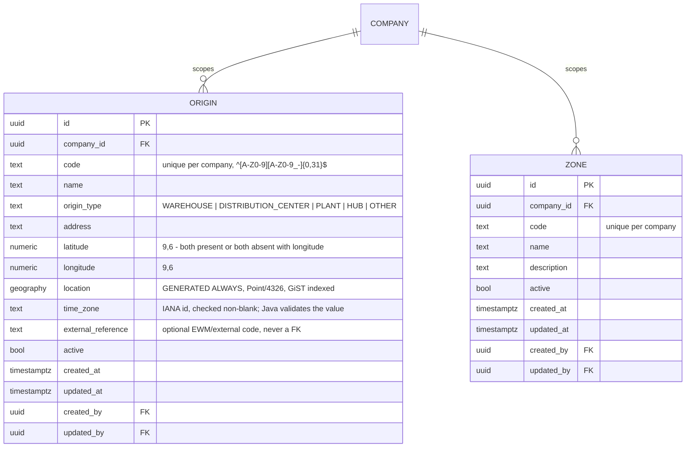

# TMS by EBIM - data model (V1 identity, tenancy and master data)

Owner: Flyway migrations under `backend/tms-api/src/main/resources/db/migration` (ADR-002).
Scope of this document: the identity/tenancy baseline (V1-V5) plus the master data tables
Step 05 onwards adds on top of it, without changing its rules.

## 1. Where the schema lives

| Object | Location | Why |
|---|---|---|
| Application tables | schema `tms` | `supabase/config.toml` exposes only `public` and `graphql_public` through the Data API, so a separate schema removes the HTTP surface entirely |
| Flyway history | `tms.flyway_schema_history` | one history, next to the objects it describes |
| PostGIS | extension in `public` | shared platform capability; V6 (Step 05) is the first migration that uses it, for `tms.origin.location` |
| Supabase `auth`, `storage` | untouched | Supabase-managed; Flyway never creates or alters them |

Consequences for the backend: `spring.flyway.default-schema=tms` and
`hibernate.default_schema=tms` are set once in `application.yml`, so entities do not repeat
the schema on every `@Table`.

## 2. Entity relationships

ASCII summary of the tenancy path used on every authenticated request:

    Supabase auth.users.id  (from the validated JWT)
              |
              v
    tms.app_user.auth_user_id -> app_user.id
              |
              v
    tms.membership  (active rows)  ->  organization_id [+ company_id | NULL]
              |
              v
    tms.membership_role -> tms.role -> tms.role_permission -> tms.permission

## 3. Design decisions and their reasons

### 3.1 Company is the operational scope, organization is the boundary

Per ADR-003. Business tables from Step 05 onwards carry `company_id` **only**.

`membership` is the single deliberate exception that carries both `organization_id` and
`company_id`, and the reason is recorded in the migration itself:

1. `company_id IS NULL` means *organization-wide* membership; without `organization_id`
   such a row could not name its tenant.
2. The composite foreign key `(company_id, organization_id) -> company (id, organization_id)`
   makes "the company must belong to this organization" a database guarantee. A single
   `company_id` column would leave that invariant to application code.

### 3.2 `app_user` is not tenant-scoped

A person may work for more than one organization, so identity is global and tenancy comes
from `membership`. `app_user` therefore has no `organization_id`.

### 3.3 No foreign key to `auth.users`

`app_user.auth_user_id` holds the Supabase Auth user id, unique and nullable, with no FK:

- Flyway must not depend on or lock the Supabase-managed `auth` schema (ADR-002);
- TMS stays portable if the identity provider changes;
- integration tests run on plain PostgreSQL, where `auth` does not exist;
- nullable because an administrator can create a profile before the invitation is accepted.

The mapping is established server-side by the backend after JWT validation (Step 03).

### 3.4 `membership_role` is a link table (refinement of ADR-003)

ADR-003 sketched a single role on the membership row. A many-to-many link is used instead
because a person frequently holds more than one role in the same company, and a single role
column would force duplicate membership rows for the same `(user, company)` pair - which
the unique indexes correctly forbid. The ADR decision (membership is the source of truth
for tenancy and role) is unchanged; only its cardinality is refined. `role.scope_level`
records whether a role belongs on an organization-wide or company-scoped membership; Java
enforces that pairing, because expressing it in SQL would need a trigger for no real gain.

### 3.5 Deletes never erase history

Every foreign key is `ON DELETE RESTRICT` except two pure configuration links:

| Link | Behaviour | Reason |
|---|---|---|
| `role_permission.role_id` | `CASCADE` | deleting a role legitimately removes its own grants |
| `membership_role.membership_id` | `CASCADE` | the link has no meaning without its membership |

Everything else - organizations with companies, companies with memberships, users that
appear in `created_by`/`updated_by` - refuses to be deleted. Long-lived rows are
**deactivated** through their `active` flag.

### 3.6 Actor columns only where an actor exists

`created_by`/`updated_by` reference `app_user` on `organization`, `company`, `app_user`,
`membership` and `membership_role`. `role` and `permission` have none: their rows are
reference data inserted by migration V3, where no actor exists. Inventing a system user to
fill the column would be worse than leaving it out.

### 3.7 `updated_at` is stamped by the database

`tms.set_updated_at()` runs `BEFORE UPDATE` on every table that has `updated_at`, so the
column is correct no matter which writer produced the change and cannot be spoofed by the
application. `now()` is the transaction timestamp, so `created_at` and `updated_at` are
equal for a row inserted and updated in the same transaction - that is intended.

The triggers deliberately carry no `WHEN (OLD.* IS DISTINCT FROM NEW.*)` filter: PostgreSQL
rejects whole-row references in a `BEFORE` trigger `WHEN` clause on tables with generated
columns, which `tms.permission` already has and the spatial tables of Steps 05/06 will have.

### 3.8 Normalization is enforced, not assumed

| Column | Rule |
|---|---|
| `organization.code`, `company.code` | `^[A-Z0-9][A-Z0-9_-]{1,31}$` |
| `role.code` | `^[A-Z][A-Z0-9_]{2,39}$` |
| `permission.resource` | dotted lower snake case, e.g. `masterdata.origin` |
| `permission.action` | lower snake case, e.g. `read`, `manage` |
| `app_user.email` | must equal `lower(btrim(email))` and match a basic address shape |
| names, `time_zone`, `tax_identifier` | not blank when present |

`company.time_zone` is only checked for blankness: a `CHECK` cannot query
`pg_timezone_names`. Java validates the IANA value.

## 4. Indexes

| Index | Purpose |
|---|---|
| `uq_organization_code` | organization codes are unique installation-wide |
| `uq_company_organization_code` | company codes unique per organization; also serves "companies of an organization" |
| `uq_company_id_organization` | target of the membership composite FK |
| `uq_app_user_email`, `uq_app_user_auth_user_id` | one profile per address, one profile per auth identity |
| `uq_membership_user_organization_company` (partial, `company_id IS NOT NULL`) | one membership per user and company |
| `uq_membership_user_organization_wide` (partial, `company_id IS NULL`) | one organization-wide membership per user |
| `ix_membership_app_user_active` (partial, `active`) | the hot path: JWT -> app_user -> active memberships |
| `ix_membership_company`, `ix_membership_organization` | administration screens: who may act here |
| `ix_role_permission_permission`, `ix_membership_role_role` | reverse lookups and impact analysis |
| `uq_permission_resource_action`, `uq_permission_code` | one row per capability, one stable string form |

Two partial unique indexes are used instead of `UNIQUE NULLS NOT DISTINCT` so the intent is
explicit and does not depend on a PostgreSQL 15+ behaviour change.

## 5. Reference data shipped by migrations

Migration V3 inserts the authorization catalogue - and nothing else. No organization, no
company, no user, no membership, no credential.

| Role | Scope | Grants |
|---|---|---|
| `ORGANIZATION_ADMIN` | ORGANIZATION | all 29 permissions |
| `COMPANY_ADMIN` | COMPANY | all except `iam.organization:manage` |
| `PLANNER` | COMPANY | reads company, master data and fleet; manages `orders.order` and `planning.trip` |
| `VIEWER` | COMPANY | read-only on company, master data, fleet, orders and trips |

Permissions cover the V1 modules only: `iam.*`, `masterdata.*`, `fleet.*`, `orders.order`,
`planning.trip`, `audit.log`. `audit.log` has a `read` permission and deliberately no
`manage`: the audit trail is append-only.

Demo tenants and users live in `supabase/seeds/local_dev_seed.sql`, outside the migration
history, and are verified by `LocalSeedIntegrationTest`.

## 6. What the tests prove

`backend/tms-api/src/test/java/com/ebim/tms/database/`:

| Test | Proves |
|---|---|
| `FlywayMigrationIntegrationTest` | the history applies to an empty database, validates, is idempotent, replays deterministically, and PostGIS is present |
| `TenancyConstraintIntegrationTest` | company code scoping, cross-organization membership refusal, membership uniqueness, RESTRICT deletes, cascade limits, email/code normalization, `updated_at` trigger, seeded catalogue |
| `SchemaExposureIntegrationTest` | RLS enabled on every table (including `origin`/`zone` since V6), no policies, not forced, PUBLIC and Supabase API roles denied, nothing published in `public` |
| `MasterDataConstraintIntegrationTest` | origin/zone code uniqueness is per-company, not installation-wide; FK to a real company; code normalization; the latitude/longitude pair and range checks; the generated `location` column reflects a valid pair and is `NULL` when coordinates are absent; `origin_type` is restricted to the catalogue; defaults and actor columns |
| `ApplicationDatabaseStartupIntegrationTest` | the real Spring context boots with datasource + JPA + Flyway against PostgreSQL |
| `LocalSeedIntegrationTest` | the local seed still matches the schema and carries no credential |
| `MigrationConventionTest` | naming, contiguous versions, no destructive DDL, no `auth`/`storage` DDL, no tenant data in migrations, no `supabase/migrations` |

The origin/zone vertical slice itself (controller through repository, company scoping,
permissions) is proven end to end by
`backend/tms-api/src/test/java/com/ebim/tms/masterdata/api/OriginZoneApiIntegrationTest.java`
rather than repeated in the database-level test above - see
`docs/overnight/05_ORIGINS_ZONES.md` section 4 for that coverage.

## 7. Master data: origins and zones (Step 05, migration V6)

The first business masters built on top of the V1-V5 baseline, following every rule section 8
sets for the migrations after it unchanged: `company_id NOT NULL` with an FK to `tms.company` and an index
leading with it, `created_at`/`updated_at` plus the `set_updated_at` trigger, actor columns
(a real actor - the authenticated caller - exists for both tables), RLS enabled in the same
migration, and a normalized-code `CHECK` rather than convention alone.

### 7.1 `location` is generated, not written

`tms.origin.location` is `GENERATED ALWAYS AS (ST_SetSRID(ST_MakePoint(longitude, latitude),
4326)::geography) STORED`. Neither JPA nor the API ever populate it: `Origin` (the entity)
does not map the column at all, so create/update stay ordinary numeric-column CRUD
(architecture section 8's requirement) while the database derives the spatial value for a
future nearest-origin/within-radius query. `ST_MakePoint` propagates `NULL`, so an origin
with no coordinates simply has a `NULL` location - no `CASE` needed, and
`ck_origin_coordinates_pair` guarantees latitude/longitude are never half-set. `ix_origin_location`
is a GiST index maintained on every write starting now, so a later step's spatial query does
not need a second migration to add one retroactively.

### 7.2 `external_reference` is the EWM boundary, not a foreign key

Per the repository's independence rule (no shared internal tables or cross-product FKs
between TMS and EWM), `origin.external_reference` is a free-text optional column - a place to
record a future EWM warehouse id or similar - never a foreign key into another product's
schema. Nothing reads or validates it against an external system in V1.

### 7.3 Zones stay attribute-only in V1

`tms.zone` intentionally carries no geometry: code, name, optional description, active,
audit. The step brief asked for zone geofencing to be *possible* later without forcing
polygons in now; a future migration can add a nullable geometry column to this same table
without changing its shape or breaking existing rows, exactly like `location` was added to
`origin` without touching `organization`/`company`.

### 7.4 Indexes added by V6

| Index | Purpose |
|---|---|
| `uq_origin_company_code`, `uq_zone_company_code` | codes unique per company, free to repeat across companies (ADR-003) |
| `ix_origin_company`, `ix_zone_company` | the hot path: "list mine", company-scoped queries lead with `company_id` |
| `ix_origin_location` (GiST) | future spatial queries against `location`; not yet queried in V1, maintained from day one |

## 8. Rules for the next migrations

1. Business tables carry `company_id NOT NULL` with an FK to `tms.company` and an index
   that leads with it. Never both scope columns without a documented reason.
2. New tables get `created_at`, `updated_at`, the `set_updated_at` trigger, and actor
   columns when a real actor exists.
3. New tables are added to the `ENABLE ROW LEVEL SECURITY` list in the same migration.
4. Spatial columns follow `docs/database/MIGRATION_STRATEGY.md` section on PostGIS.
5. Every vertical slice adds a cross-tenant isolation test (ADR-003 compliance rule).

V6 (Step 05) is the first migration to follow all five rules against a real business table;
Step 06 onward (destinations, frequencies, routes) should match its shape rather than
reinvent it.
