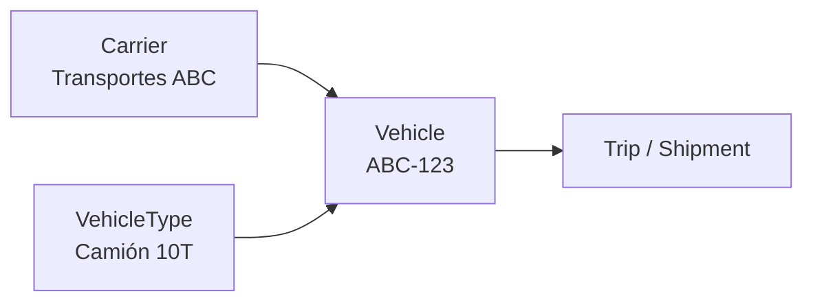

# Flota: transportistas, tipos de unidad y unidades

Contrato de dominio. Migraciones: `V9__fleet_masters.sql`,
`V16__fleet_external_reference_and_double_booking.sql`.
Detalle de capacidad: `docs/domain/CAPACITY_MODEL.md`.

---

## 1. Las tres piezas



---

## 2. Carrier

```text
code                único por compañía
businessName
identificationType  RUC, DNI, …
identificationNumber
contactName, phone, email
externalSystem / externalReference   identidad de idempotencia para integraciones
active
```

---

## 3. VehicleType

La plantilla de capacidad:

```text
code, name
maxWeightKg     obligatorio
maxVolumeM3     obligatorio
maxPallets      obligatorio
bodyType        opcional
active
```

Largo/ancho/alto, temperatura, ejes y restricciones no existen todavía. Las tres dimensiones que
el producto sí valida son peso, volumen y pallets; añadir columnas que ninguna regla lee sería
maestro que envejece sin usarse.

---

## 4. Vehicle

Una unidad física.

```text
code                único por compañía
licensePlate        único por compañía
carrier             opcional (flota propia)
vehicleType         obligatorio
maxWeightKg / maxVolumeM3 / maxPallets   overrides opcionales
availabilityStatus  AVAILABLE | IN_MAINTENANCE | OUT_OF_SERVICE
externalSystem / externalReference
active
```

### Capacidad efectiva

```text
override de la unidad
        ↓ si es null
default del tipo de unidad
```

Resuelto en **un solo lugar**: `EffectiveCapacityResolver`. `planning` nunca vuelve a derivar
capacidad desde un tipo — la recibe ya resuelta a través de `VehicleLookupPort`
(`docs/architecture/OWNERSHIP_MATRIX.md`, "Capacity checks"). Dos resolutores serían dos
respuestas a "¿cuánto lleva este camión?".

Cero es un límite real, no "sin límite": una cisterna con `maxPallets = 0` no lleva pallets.

### Asignable

Una unidad puede planificarse sólo si es de la compañía, está `active` y está `AVAILABLE`.
Cualquier otro estado no resuelve en absoluto, de modo que planning responde 400/404 sin llegar
a saber por qué una unidad de otra compañía "no existe".

---

## 5. La invariante de doble reserva

```text
1 unidad · 1 viaje activo · 1 fecha de planificación
```

Ya existía antes de este trabajo (`V16`) y **no se duplicó**: es un índice único parcial en base
de datos más la comprobación en `TripService`, con la excepción de base de datos traducida a
conflicto como red de seguridad ante una carrera.

Se apoya en `planningDate` porque es lo que el modelo conoce hoy. `plannedDepartureAt` existe,
pero no hay hora real de llegada, así que un solapamiento por rangos no sería más verdadero — sólo
más complicado. Cuando exista ejecución con horas reales, la regla se estrecha; hasta entonces,
una unidad por día es la afirmación honesta.

La planificación automática **filtra antes de proponer** las unidades ya comprometidas ese día.
Si no lo hiciera, su "no hay unidad disponible" sería un artefacto de su propia aritmética en vez
de un hecho.

---

## 6. Multitenancy

Los tres maestros son company-scoped, con FK compuesta `(id, company_id)` en cada referencia
(`vehicle → carrier`, `vehicle → vehicle_type`, `trip → vehicle`) y RLS por compañía. Un vehículo
de la compañía A no puede apuntar a un tipo de la B ni siquiera por SQL directo.

---

## 7. UX

Tres listas con el mismo patrón (búsqueda, estado, paginación de servidor, acciones en overlay) y
un `TmsDrawer` por maestro. `VehicleFormDrawer` muestra la capacidad efectiva mientras se edita,
para que un override se vea contra el default que reemplaza en vez de a ciegas.

Los tres soportan importación masiva por el Import Center (`docs/domain/IMPORT_FLOW_V1.md`).
