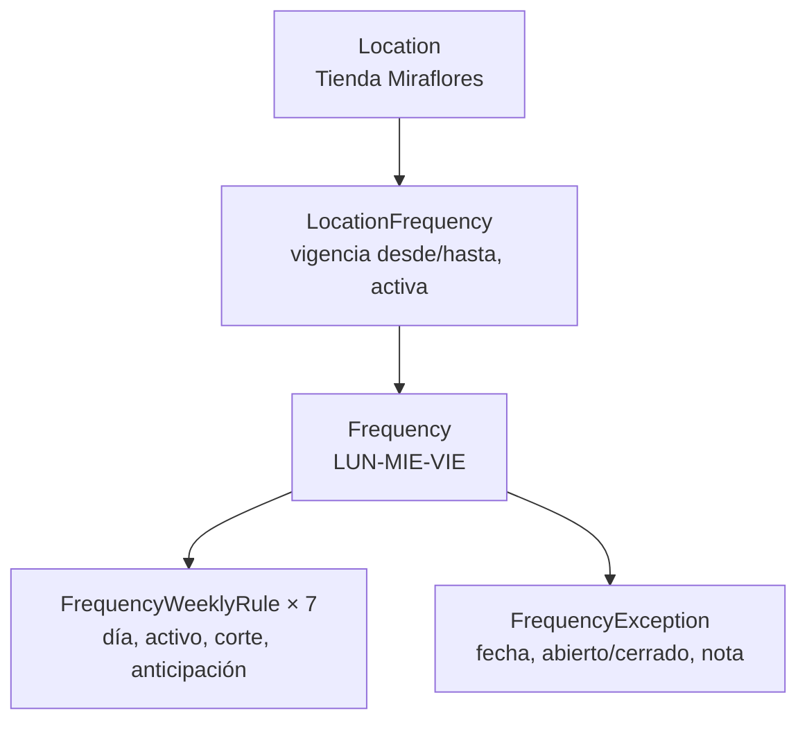

# Frecuencias y calendarios de servicio

Contrato de dominio: qué días puede atenderse una ubicación, con qué corte y con cuánta
anticipación, y qué pasa en las fechas que se apartan de esa cadencia.

Migraciones: `V7__masterdata_destinations_frequencies.sql` (frecuencia, reglas semanales,
excepciones), `V15__masterdata_location_frequency.sql` (la asociación con la ubicación) y
`V24__frequency_exception_cutoff_and_route_stop_service_time.sql` (corte por fecha).

---

## 1. El modelo, y por qué tiene tres piezas



La pieza que suele sorprender es `LocationFrequency`. Una ubicación **no** apunta a una
frecuencia con `location.frequency_id`, y eso es deliberado: una tienda puede recibir mercadería
lunes/miércoles/viernes y despachar devoluciones martes/jueves, y una columna sola cierra esa
puerta. La asociación es una entidad propia con vigencia (`effective_from` / `effective_to`) y
estado, de modo que un cambio de calendario en octubre no reescribe lo que regía en septiembre.

Hoy el producto no distingue "recepción" de "recojo" — no hay tipo de asociación. La estructura
admite varias asociaciones por ubicación y la evaluación las considera todas; etiquetar cada una
con su propósito es una columna nueva el día que exista el requisito, no antes.

---

## 2. Frequency

```text
code            único por compañía, normalizado
name
description
weeklyRules     siempre 7, una por día (lunes = 1 … domingo = 7)
active
```

Cada regla semanal lleva:

```text
dayOfWeek       1..7
enabled         ¿se atiende ese día?
cutoffTime      hora de corte, opcional
leadTimeDays    anticipación en días, opcional
```

Las siete filas se escriben siempre, habilitadas o no. Un calendario con "los días que faltan
significan no" es un calendario que hay que leer dos veces.

Ejemplo:

```text
Tienda Miraflores

LUN   sí     corte 15:00   anticipación 1
MAR   no
MIE   sí     corte 15:00   anticipación 1
JUE   no
VIE   sí     corte 15:00   anticipación 1
SAB   no
DOM   no
```

---

## 3. Excepciones por fecha

Una regla semanal dice "miércoles". El 25 de diciembre es miércoles y el depósito está cerrado; el
sábado anterior trabaja todo el mundo. Ninguna de las dos cosas se puede expresar editando la
cadencia — cambiarla cambiaría todas las semanas.

`frequency_exception` tiene exactamente dos formas, según `service_override`:

| Valor | Significado | UI |
|---|---|---|
| `false` | **Cerrado**: quita una fecha que la cadencia habría atendido | `Cerrado` |
| `true` | **Abierto**: agrega una fecha que la cadencia no atendería | `Abierto` |

```text
25/12   CERRADO   Navidad
19/12   ABIERTO   Refuerzo pre-navideño
```

### Corte propio de una fecha (V24)

Una fecha abierta puede además **cerrar a otra hora**. Es lo tercero que la cadencia no puede
decir: mover el corte del miércoles movería el de todos los miércoles del año.

```text
Cadencia normal   corte 15:00
24/12  ABIERTO    corte 11:00
25/12  CERRADO
```

`cutoff_time_override` es nullable y el nulo significa *no opino*:

```text
effectiveCutoff = exception.cutoffTimeOverride ?? weeklyRule.cutoffTime
```

Esa precedencia vive en un solo lugar, `FrequencyCalendar.effectiveCutoff`, y es una función
pura probada sin base de datos. Un `null` como resultado significa **no rige ningún corte** —
por ejemplo un día extra sobre un día de la semana que la cadencia nunca atiende — nunca
"ya cerró".

**Una fecha cerrada no lleva corte.** No se despacha nada, así que no existe una "última hora
para pedir"; guardarla sería un dato que nadie puede usar y que sobreviviría como hora fantasma
si más tarde la fecha se reabre. La regla se sostiene en tres capas: el servicio responde 400,
el constructor de `FrequencyException` la rechaza, y
`ck_frequency_exception_cutoff_requires_service` la rechaza contra SQL directo.

`leadTimeDays` **no** tiene excepción por fecha: describe con cuánta anticipación se toman los
pedidos de esa cadencia, y que un día cierre antes no cambia esa ventana.

---

## 4. La decisión de elegibilidad

`LocationEligibilityEvaluator` es una función pura — sin repositorio, sin Spring — y por eso está
probada directamente. `LocationEligibilityService` orquesta: carga las asociaciones de la
ubicación, sus frecuencias y la excepción de la fecha, y delega.

Orden de resolución para una fecha:

```text
1. ¿La ubicación está activa?              no → no elegible
2. ¿Alguna asociación activa cubre la fecha? no → no elegible
3. Para cada candidata, en orden:
     ¿hay excepción para esa fecha?  → la excepción manda (abierto/cerrado)
     si no                           → manda la regla semanal
4. La primera que atienda gana, y devuelve su corte efectivo y su anticipación.
```

El corte que devuelve es el efectivo: si la excepción de esa fecha trae `cutoffTimeOverride`,
es el suyo; si no, el de la regla semanal.

Una ubicación servida por dos calendarios sólo necesita que **uno** atienda la fecha.

---

## 5. Dónde se usa

| Consumidor | Cómo |
|---|---|
| Drawer de Ubicación | Panel de calendario de servicio + verificación de elegibilidad para una fecha |
| Planificación automática | `ServiceCalendarPort.serviceableOn(...)`, en lote, para filtrar el backlog del día |
| Rutas | Una ruta maestra puede referenciar una frecuencia como cadencia sugerida del corredor |

**Crear un pedido no consulta el calendario.** Un cliente puede pedir un martes para una tienda
que se atiende lunes/miércoles/viernes, y rechazar el pedido sería rechazar el negocio. Lo que no
debe ocurrir es que ese pedido termine silenciosamente en un camión del martes — por eso el
calendario es un filtro de **planificación**. Ver `docs/domain/ORDERS.md`.

Regla asociada: una ubicación **sin ningún calendario** cuenta como atendible. El operador que no
configuró un calendario no dijo "nunca".

---

## 6. Multitenancy

`frequency` y `location_frequency` son company-scoped, con FK compuesta `(id, company_id)` en
cada referencia y política RLS por compañía (ADR-005). `frequency_weekly_rule` y
`frequency_exception` son hijos puros de `frequency`: sin `company_id` propio, alcanzables
exactamente cuando su padre lo es.

---

## 7. UX

**Lista** (`/masters/frequencies`): búsqueda, estado, resumen de días.

**Drawer**:

```text
IDENTIFICACIÓN        código, nombre, descripción
CADENCIA SEMANAL      los 7 días en una grilla, con corte y anticipación por día
EXCEPCIONES           fechas cerradas/abiertas, con corte propio y nota  (sólo al editar)
ESTADO                activo
```

El campo de corte aparece **sólo** cuando el tipo es abierto, y cambiar a cerrado borra lo que
se hubiera escrito: un campo oculto no puede enviarse a espaldas del operador. Vacío no es "sin
corte" sino "rige el de la regla semanal", y la ayuda del campo lo dice.

Las excepciones son un sub-recurso con endpoints propios, así que son un panel y no campos del
formulario: cada fila es una llamada a la API y necesita una frecuencia guardada de la que
colgar. Al crear, el panel dice que hay que guardar primero — mejor que un panel que parece roto
porque cada llamada daría 404.
