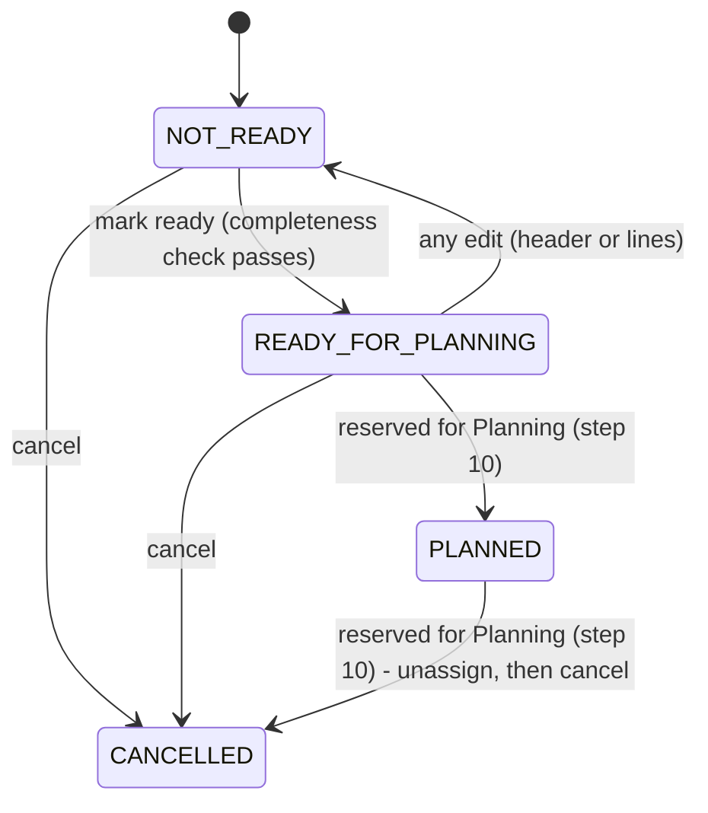

# TMS by EBIM - order lifecycle (V1)

Owner: `com.ebim.tms.orders` (backend), schema owner `backend/tms-api/src/main/resources/db/migration/V10__orders.sql`.
Scope: the transport order status lifecycle introduced in Step 09. Does not cover Planning
(step 10, not built) or dispatch/delivery/EWM integration (deferred by decision).

## 1. Why a lifecycle exists at all

The step 09 brief asks for a "minimal V1 lifecycle" that at minimum distinguishes:

- orders not ready for planning,
- orders ready for planning,
- orders planned/assigned,
- cancelled orders,

and is explicit that this module must not pretend dispatch/delivery integration exists. V1
therefore stops at "planned", which nothing in this step actually sets - that state is reserved
for a future Planning module (step 10) to reach.

## 2. States

| State | Meaning | Set by |
|---|---|---|
| `NOT_READY` | The default state of every newly created order. May be missing lines, or have lines whose combined weight/volume/pallets are all unknown. Fully editable. | `OrderService.create`; also re-entered from `READY_FOR_PLANNING` by any edit (section 4) |
| `READY_FOR_PLANNING` | The order passed the completeness check (section 3) and is visible to a future Planning module as plannable. Still editable, because a planner may need to fix a detail before it is actually planned. | `OrderService.markReadyForPlanning` |
| `PLANNED` | Assigned to a trip. **No endpoint in this step sets this state** - it exists in the enum (`OrderStatus.PLANNED`) and the schema `CHECK` so Planning (step 10) has a state to transition into without a schema change, and so `OrderService.cancel`'s rule for it (section 5) is meaningful from day one. | Reserved for a future Planning module; `TransportOrder.markPlanned` exists but is not called from any controller yet |
| `CANCELLED` | Terminal. Not editable. Carries an optional `cancelReason`. | `OrderService.cancel` |



There is no `DELIVERED`/`COMPLETED`/`IN_TRANSIT` state. Those describe dispatch/delivery
execution, which this step's brief explicitly says not to pretend exists yet.

## 3. Completeness check for "mark ready for planning"

`OrderService.markReadyForPlanning` only accepts a transition from `NOT_READY`, and only when:

1. the order has at least one line (`order.lines()` is not empty), and
2. at least one of `totalWeightKg`, `totalVolumeM3`, `totalPallets` is greater than zero.

Every header field required for planning (origin, destination, service date, priority) is
already mandatory at create/update time - the schema and `OrderService`/`OrderRequest`
validation make it impossible to persist an order missing one of them, so there is nothing left
to re-check about the header at this gate. The only fact that can legitimately be true at
create time and false at "ready" time is "does this order carry enough capacity information to
plan against" - which is exactly what the two checks above verify. A request that fails either
check gets `409 Conflict` (`conflict`), not `400` - the order is a real, valid order; it is
simply not *ready*.

## 4. Editing resets readiness

`OrderService.update` is reachable only while `status` is `NOT_READY` or `READY_FOR_PLANNING`
(`OrderService.requireEditable`); `PLANNED` and `CANCELLED` orders reject every update with
`409 Conflict`. Whenever an editable order is updated - header fields, lines, or both -
`TransportOrder.applyChanges` unconditionally resets `status` back to `NOT_READY`.

This is a deliberate simplification over re-validating completeness on every edit: it would be
possible to re-run the section 3 checks after each update and leave the order `READY_FOR_PLANNING`
if they still pass, but that adds a second code path with the same rules as
`markReadyForPlanning` and a subtle question ("did this edit actually change anything relevant to
readiness?") that has no clean answer. Resetting to `NOT_READY` on every edit is unconditional,
easy to reason about, and cheap for the caller: `POST .../mark-ready` is one more call after a
save. If this becomes a real UX friction point after usage, revisit with a documented reason -
the same bar every other "add complexity later" decision in this repository uses.

## 5. Cancellation rules

`OrderService.cancel`:

| Current status | Result |
|---|---|
| `NOT_READY` | Cancelled. |
| `READY_FOR_PLANNING` | Cancelled. |
| `PLANNED` | Refused with `409 Conflict`: "unassign it from its trip first." Not reachable via this step's API (nothing sets `PLANNED` yet), but the rule is coded and tested now so Planning (step 10) inherits a correct invariant instead of having to add it later. |
| `CANCELLED` | Refused with `409 Conflict`: already cancelled - cancellation is not idempotent, unlike a master's activate/deactivate toggle, because "cancel" is a one-way business event, not a flag. |

`cancelReason` is optional free text, stored only when the transition succeeds
(`ck_transport_order_cancel_reason_requires_cancelled` enforces this at the database level too).

## 6. Totals strategy

`total_weight_kg`/`total_volume_m3`/`total_pallets` on `tms.transport_order` are a **transactional
snapshot**, not a live `SUM(...)` computed on every read. This is safe only under a specific,
verified condition: `TransportOrder` (the JPA aggregate root) is the *only* writer of
`transport_order_line` rows - `OrderService` never issues a line-level write that bypasses
`TransportOrder.applyLines`, and `TransportOrder.applyLines` recomputes all three totals from the
line set it just wrote (`TransportOrder.recomputeTotals`) inside the same method, hence the same
flush, as the line change itself. There is no create/update path that changes lines without also
refreshing the header snapshot.

Why persist instead of compute on read:

- Planning (step 10) needs a fast, indexable "does this order fit in that vehicle" check across
  potentially thousands of orders per company; summing lines per order on every planning-board
  load does not scale to the 10,000+ orders/day target.
- The frontend never computes or submits a total - `OrderRequest` carries lines only,
  `OrderService` computes and persists the totals, and the response
  (`OrderView`/`OrderDetailView`) always reflects the server's number. See
  `docs/database/DATA_MODEL.md` section 12.3 for the schema-level version of this reasoning, and
  `OrderApiIntegrationTest`'s totals-recomputation tests for the proof (add a line, remove a
  line, change a quantity - the header always matches the sum, verified through the real HTTP
  API, not by calling `TransportOrder` directly).

If a second writer of order lines is ever introduced (a bulk EDI importer that does not go
through `OrderService`, for instance), it must call the same recomputation path. That is a new,
explicit design decision when it happens - not something this snapshot silently tolerates today.

## 7. Concurrency

`TransportOrder.version` (`bigint`, JPA `@Version`) is the first optimistic-locking column in
this schema - Orders is the first module where two people plausibly edit the same row through
separate HTTP round trips (a planner editing an order's lines while dispatch corrects its
customer reference, for instance).

`OrderService.update` requires `OrderRequest.version` and compares it explicitly to the
persisted order's version *before* applying any change:

```
GET  /orders/{id}          -> version: 3, ...
PUT  /orders/{id} {version: 3, ...}   -> succeeds, order is now version: 4
PUT  /orders/{id} {version: 3, ...}   -> 409 Conflict: someone else changed it since you loaded it
```

This explicit check is what actually catches the common case (a client holding a stale copy from
before someone else's edit landed). JPA's own `@Version`-driven optimistic lock
(`ObjectOptimisticLockingFailureException`, caught in `OrderService.saveOrConflict` and, as a
backstop, in `ApiExceptionHandler.handleOptimisticLockingFailure`) is kept as a second, narrower
guard for the case the explicit check cannot see: two transactions racing to flush at the same
instant, both having read the same version. Both failure paths return the same `409 Conflict`
(`conflict`) document.

## 8. What is deliberately out of scope for V1

- **No dispatch/delivery status** (`IN_TRANSIT`, `DELIVERED`, `POD_RECEIVED`, ...) - the brief's
  explicit "do not pretend integration exists".
- **No vehicle/carrier/route assignment on the order itself** - that belongs to Planning (step
  10); an order in V1 only ever names an origin and a destination.
- **No automatic re-validation of `READY_FOR_PLANNING` on edit** - see section 4.
- **No idempotent replay of `external_reference`** - a duplicate is rejected (409), not answered
  with the original resource. See `docs/database/DATA_MODEL.md` section 12.2.
