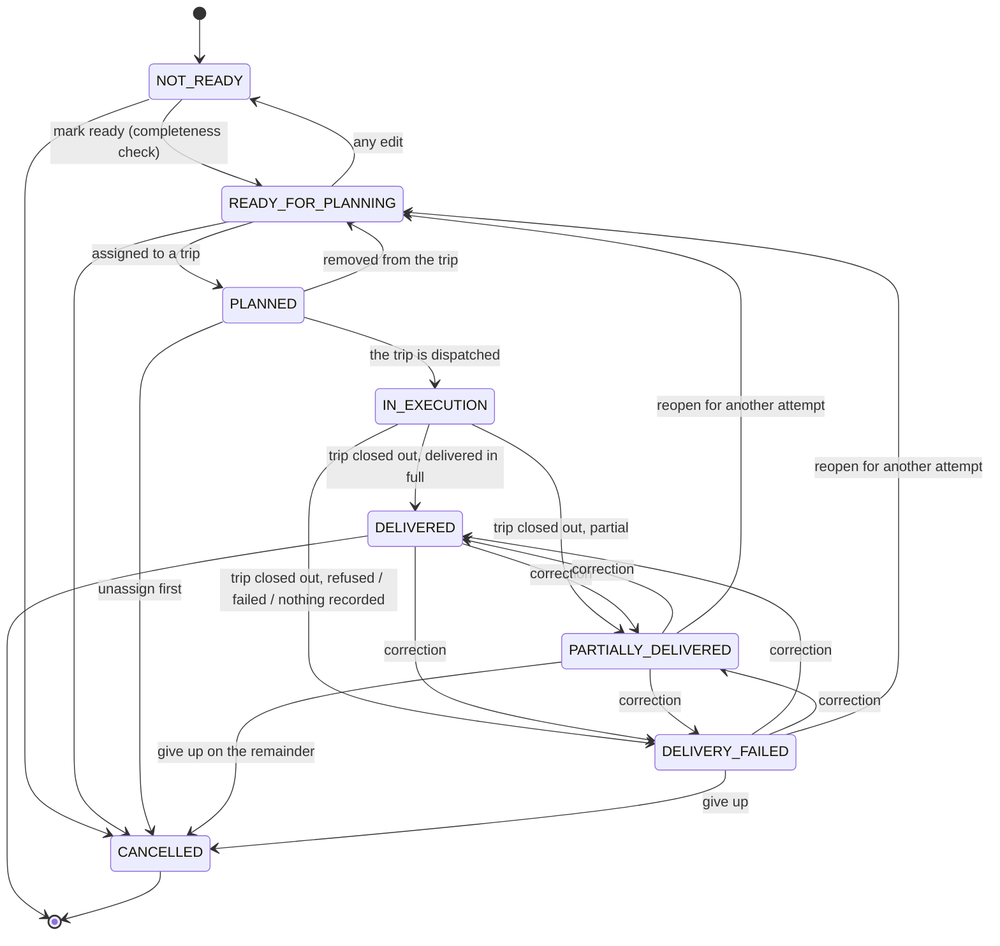

# TMS by EBIM - order lifecycle (V2)

Owner: `com.ebim.tms.orders`. Schema owner: `V10__orders.sql` and `V36__order_execution_lifecycle.sql`.
Supersedes `ORDER_LIFECYCLE_V1.md`, which stays as the record of the four-state minimum V1 shipped
with and of why it stopped where it did.

## 1. The states

| State | Meaning | Set by |
|---|---|---|
| `NOT_READY` | Default for every new order. Fully editable. Re-entered by any edit. | `OrderService.create`, `TransportOrder.applyChanges` |
| `READY_FOR_PLANNING` | Passed the completeness check; visible to planning. Still editable. | `OrderService.markReadyForPlanning`, `OrderPlanningService.releaseFromPlanning`, `OrderService.reopenForPlanning` |
| `PLANNED` | On a trip that has not departed. The goods are on the dock; the plan can still be undone. | `TripService.assignOrder` via `OrderPlanningPort.markPlanned` |
| `IN_EXECUTION` | The vehicle carrying it has left. Not editable, not cancellable, not removable. | `TripExecutionService.dispatch` via `OrderPlanningPort.markInExecution` |
| `DELIVERED` | The customer got everything they were owed. | trip close-out, or a correction |
| `PARTIALLY_DELIVERED` | Some handed over, some not. The remainder is still owed. | trip close-out, or a correction |
| `DELIVERY_FAILED` | The trip finished and the goods did not arrive: refused, failed, never taken off, or never recorded. | trip close-out, or a correction |
| `CANCELLED` | Terminal. | `OrderService.cancel` |

The table lives in `orders.domain.OrderStatus` and nowhere else. `OrderStatusTest` proves it
without a database; `TransportOrder` asserts it as a last line of defense; V36's CHECK constraint
bounds the vocabulary beneath both.

## 2. Transitions come from facts, not from buttons

Only three of these moves are things a person asks for directly: mark ready, cancel, reopen.
Everything in the execution half is the consequence of something that happened to a shipment.

| Fact | What the order does |
|---|---|
| the trip is dispatched | every order on it → `IN_EXECUTION` |
| the trip is completed | each order → the outcome its delivery rows imply |
| a delivery is recorded or corrected on a **completed** trip | that order → the outcome its rows now imply |
| a delivery is recorded on a **running** trip | nothing: a later stop can still change what is owed |

`OrderExecutionPropagator` (planning) is what carries the fact; `OrderPlanningService` (orders) is
what decides what it means. See ADR-009 for why the boundary runs that way.

## 3. Why the status cannot drift from the delivery rows

This is the question ADR-009 exists to answer, and it is worth restating here because it is what
makes the whole design legitimate.

The recording window is deliberately open **after** the trip is completed: a dispatcher closes the
day at 18:00 and keys twelve signed notes at 18:40. So a status set once at completion would be
wrong forty minutes later.

It is not set once. Every write to `tms.order_delivery` recomputes the order's status from those
rows, in the same transaction. There is no moment at which the two exist and disagree.

## 4. The mapping

`OrderPlanningService.closureFor`, exhaustive with no default:

| `OrderFulfillmentStatus` | `OrderStatus` |
|---|---|
| `DELIVERED` | `DELIVERED` |
| `PARTIALLY_DELIVERED` | `PARTIALLY_DELIVERED` |
| `REJECTED` | `DELIVERY_FAILED` |
| `FAILED` | `DELIVERY_FAILED` |
| `NOT_ATTEMPTED` | `DELIVERY_FAILED` |
| `PENDING` (nothing recorded) | `DELIVERY_FAILED` |

`PENDING → DELIVERY_FAILED` is the one worth defending. The trip is over and we cannot show the
customer got the goods; saying so is honest. It is also the safe direction: `DELIVERY_FAILED` is
reopenable and `DELIVERED` is not, so if the note simply had not been keyed yet, keying it corrects
the order automatically. Guessing `DELIVERED` would be unrecoverable and untrue.

## 5. Multiple delivery attempts

`POST /orders/{id}/reopen` moves `PARTIALLY_DELIVERED` or `DELIVERY_FAILED` back to
`READY_FOR_PLANNING`. Anything else is refused with 409.

- **A person does this, not the close-out.** A redelivery costs a truck. Silently re-queueing every
  refusal would plan work nobody agreed to pay for.
- **It is audited** as `ORDER_REOPENED`, carrying the status it was reopened from and the optional
  reason - which is the record of *why* a second attempt was needed.
- **The first attempt is kept.** The delivery rows are not erased; `uq_order_delivery_stop_order` is
  per stop, so a second attempt on another trip adds a row rather than replacing one. That is what
  lets "this has failed twice" be answered at all.

## 6. What each guard refuses

| Action | Refused when | Because |
|---|---|---|
| edit | not `NOT_READY` / `READY_FOR_PLANNING` | the plan or the goods have moved on |
| mark ready | not `NOT_READY` | it is already at least ready |
| cancel | `PLANNED` | unassign it from its trip first |
| cancel | `IN_EXECUTION` | the goods are on a moving vehicle; "this did not happen" is no longer true |
| cancel | `DELIVERED` | it already happened |
| cancel | `CANCELLED` | already final |
| reopen | anything not a shortfall | nothing is owed, or it is terminal |
| dispatch | `NOT_READY`, `READY_FOR_PLANNING`, `CANCELLED` | it was never committed to this trip |

## 7. Idempotency and concurrency

- Both execution transitions take the order's **row lock** before reading its status. Dispatch
  moves every order on a trip in one transaction; two dispatchers racing the same shipment would
  otherwise both read `PLANNED` and both write.
- `markInExecution` on an order already in execution, or already closed out, does nothing and
  writes nothing. A retried dispatch must not fail, and must not drag a delivered order back onto
  the road.
- `closeOut` with the status the order already holds does nothing. A close-out replayed after
  somebody reopened and replanned the order does nothing either - the transition table makes it
  safe, because `READY_FOR_PLANNING` cannot reach an outcome.

## 8. Reporting

`OrderBacklogTotals` counts the committed states separately and derives `planned()` from them, so
the identity `INPUT_ORDERS = PLANNED + UNPLANNED` still holds and the planned-rate did not fall the
day the execution states arrived. A reopened order counts as unplanned again, which is correct: a
second attempt is work still owed.

## 9. Not here

- **No attempt counter.** Answerable from the delivery rows.
- **No delivered quantities.** `PARTIALLY_DELIVERED` says something is still owed; *how much* is a
  ship-unit question (JOB 03).
- **No automatic reopening.** See section 5.
