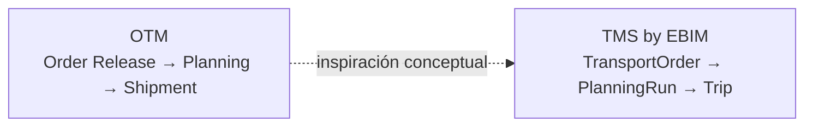
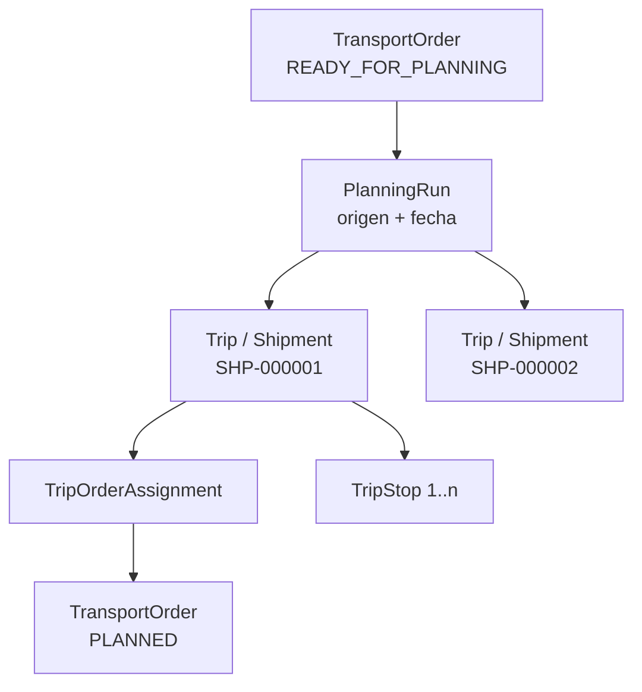
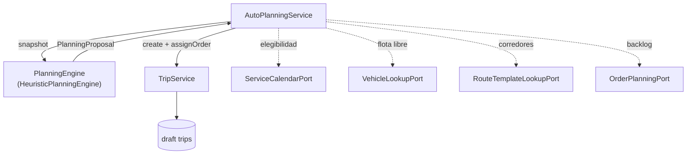

# Planning y Shipment/Trip

Contrato de dominio de la planificación: qué es una sesión de planificación, qué es un viaje, y
cómo se construye uno — a mano o automáticamente.

Migraciones: `V11__planning_manual.sql`, `V19__planning_shipment_v2.sql`,
`V20__shipment_outbox_and_outbound_scope.sql`.
Detalle previo: `docs/domain/PLANNING_MANUAL_V1.md`, `docs/domain/SHIPMENT_V2.md`,
`docs/domain/CAPACITY_MODEL.md`.

---

## 1. El eje del dominio

Tomamos la referencia conceptual de Oracle OTM, no su modelo literal:



`Trip` es el agregado operacional que en OTM se llamaría *Shipment*. El nombre técnico se
mantiene — renombrar cinco tablas y su API para parecerse a otro producto es coste sin
beneficio — y `trip.shipment_number` es la identidad estable que se publica hacia afuera.



---

## 2. PlanningRun

Una sesión de planificación: **un origen, una fecha**.

```text
planNumber        identidad legible, secuencia global
originLocation    tms.location con rol ORIGIN
planningDate      la fecha que se planifica
mode              MANUAL | AUTOMATIC
status            DRAFT → CONFIRMED | CANCELLED
version           bloqueo optimista
```

`DRAFT` es el único estado editable. Confirmar revalida cada viaje y congela su capacidad;
cancelar cancela sus viajes y devuelve cada pedido al pool.

---

## 3. Trip / Shipment

```text
tripNumber            correlativo dentro del run
shipmentNumber        identidad estable hacia afuera (SHP-…)
planningRun           el run al que pertenece
carrier / vehicle     resueltos al asignar la unidad
plannedDepartureAt    debe caer en la fecha del run (zona horaria de la compañía)
route                 corridor sugerido, opcional
capacity snapshot     congelado al confirmar
status                DRAFT → CONFIRMED | CANCELLED
```

La cabecera que ve el usuario se **resuelve**, no se duplica: transportista, placa y tipo de
unidad se leen del maestro mientras el viaje está en borrador, y se congelan al confirmar. Editar
mañana el tipo de unidad no reescribe el histórico de un shipment confirmado.

---

## 4. Capacidad

Tres dimensiones, siempre las tres: **peso, volumen, pallets**.

- El backend es la autoridad. Ninguna cantidad usada llega del cliente: se suman las filas de
  asignación activas y los límites vienen de `fleet` a través de `VehicleLookupPort`.
- Se revalida en cada mutación: asignar, quitar, mover, cambiar de unidad, confirmar.
- `null` es *sin límite* (un viaje sin unidad, que no puede confirmarse); `0` es un límite real
  de cero (la cisterna que no lleva pallets). Confundirlos permitiría cargar pallets en una
  cisterna.
- `CapacityLimits.accommodates` es la **única** definición de "cabe". `PlanningCapacityService`
  la consulta primero y sólo después construye el mensaje de rechazo, de modo que el motor
  automático no puede proponer una carga que el servicio luego rechace.

---

## 5. TripStop

Las paradas se **derivan** de las asignaciones activas, nunca se escriben a mano:

```text
Trip
 ├── Origen (el del run)
 ├── Stop 1  ← Location destino
 ├── Stop 2
 └── Stop 3
```

Varios pedidos al mismo destino son **una parada**, no una por pedido. El planificador puede
reordenar; no hay optimización automática de secuencia en V1.

Las coordenadas se leen en vivo de `tms.location`: una coordenada corregida debe llegar
inmediatamente a un plan abierto, y una copia congelada equivocada sería indetectable.

---

## 6. Planificación automática V1

### 6.1 Qué es y qué no es

Es una **propuesta**. Crea viajes en borrador sobre un run en borrador; el planificador revisa,
edita y confirma. **Nunca confirma nada.** Una planificación automática que se confirmara sola
sería un robot despachando camiones.

No modela ventanas horarias, tiempos de viaje, distancia ni costo, y no intenta ser óptima. Eso
es lo que hará un solver; `PlanningEngine` existe para que uno pueda añadirse al lado sin
rehacer planning.

### 6.2 Arquitectura



Tres decisiones sostienen esto:

1. **El motor es una función pura.** Sin repositorio, sin reloj, sin aleatoriedad. Por eso es
   demostrable por test unitario en una máquina sin base de datos — que es esta — y por eso la
   misma entrada produce siempre la misma propuesta. Un planificador que pregunta "¿por qué hizo
   eso?" necesita que la respuesta siga siendo cierta la segunda vez.
2. **Se escribe a través de `TripService`, nunca alrededor.** Cada viaje se crea y cada pedido se
   asigna por los mismos casos de uso que usan los clics del planificador, así que capacidad,
   doble reserva de unidad, derivación de paradas, transición de estado del pedido y auditoría
   aplican sin cambios. Un motor no puede producir un plan que el producto rechazaría, porque el
   producto es quien lo escribe.
3. **Ningún pedido se pierde.** Todo lo que entró en el snapshot vuelve en un viaje o en la lista
   de no planificados con un motivo, y eso se **verifica**, no se confía.

### 6.3 La heurística (HEURISTIC_V1)

```text
1. Agrupar por corredor
   Cada pedido entra al grupo de la primera ruta activa (por código) que sirve su destino.
   Los destinos sin ruta forman un último grupo.
   Un viaje NUNCA mezcla grupos.

2. Ordenar dentro del grupo
   prioridad (URGENT → LOW), fecha de servicio, posición en el corredor, número de pedido.
   La última clave es determinismo, no negocio.

3. Tomar la unidad libre más grande y llenarla mientras quepan las tres dimensiones.

4. No partir pedidos. V1 asigna pedidos completos.
```

Por qué no mezclar corredores: una carga aritméticamente excelente que visita tres corredores sin
relación es una que nadie conduciría. El agrupamiento es la diferencia entre una propuesta que el
despachador reconoce y una que descarta.

### 6.4 Los cuatro motivos de "no planificado"

| Motivo | Qué hacer |
|---|---|
| `EXCEEDS_LARGEST_VEHICLE` | Partir el pedido, o incorporar una unidad mayor |
| `NO_VEHICLE_AVAILABLE` | No quedó capacidad en la flota de esa fecha |
| `NO_FLEET` | No hay unidades disponibles para esa fecha |
| `NOT_SERVICEABLE_ON_DATE` | El destino no se atiende ese día según su calendario |

El último lo emite el servicio, nunca el motor: los calendarios son maestro, el motor es una
función pura sobre un snapshot del que esos pedidos ya fueron retirados. Aparecen igual en la
propuesta, porque "el motor no lo vio" y "nadie tiene que ocuparse de él" son afirmaciones
distintas.

### 6.5 Elegibilidad

```text
status = READY_FOR_PLANNING
origen = el del run
fecha  = la del run
destino con calendario de servicio que cubre la fecha
unidad activa, disponible, y no reservada ya ese día
```

Un destino **sin calendario configurado** cuenta como atendible. Un operador que no configuró un
calendario no dijo "nunca", y tratar el silencio como negativa haría inservible la planificación
automática el día que se enciende.

Techo deliberado: `MAX_ORDERS_PER_RUN = 1000`. Por encima se rechaza en lugar de truncar — una
propuesta construida sobre un backlog que el planificador no puede ver entero es peor que ninguna
propuesta.

### 6.6 API

```text
GET  /planning/runs/{id}/auto-plan/preview   propone, no escribe
POST /planning/runs/{id}/auto-plan           escribe viajes en borrador
```

El preview requiere `planning.plan:read` + `orders.order:read`; aplicar requiere
`planning.plan:manage` + `planning.trip:manage`, porque eso es exactamente lo que hace en nombre
del planificador. El cuerpo del POST lleva la `version` del run.

---

## 7. Publicación hacia afuera

Confirmar un viaje **no** llama a un sistema externo dentro de la transacción. Se escribe un
evento en el outbox (`V20`) y la entrega es asíncrona con reintento controlado
(`PENDING → PROCESSING → PROCESSED | FAILED`). Un ERP caído no puede dejar un plan sin confirmar.

Detalle: `docs/integrations/OUTBOUND_SHIPMENT_V1.md`.

---

## 8. Estado de verificación

| Capa | Estado |
|---|---|
| `HeuristicPlanningEngineTest` (15 casos, sin BD) | Ejecuta |
| `AutoPlanDrawer.test.tsx` (7 casos) | Ejecuta |
| `PlanningApiIntegrationTest`, `PlanningConstraintIntegrationTest`, smoke | **Skip — Docker no disponible (BASELINE E-1)** |

`AutoPlanningService` no tiene test de integración ejecutable en esta máquina. Lo que sí está
probado es el motor, que es donde vive la lógica; la orquestación delega en `TripService`, cuyas
invariantes ya tienen su propia cobertura — también saltada aquí.
